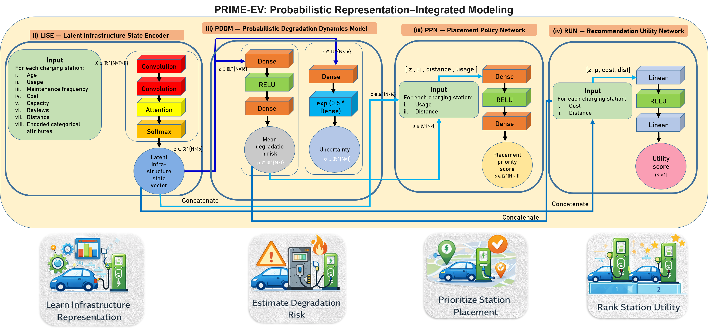
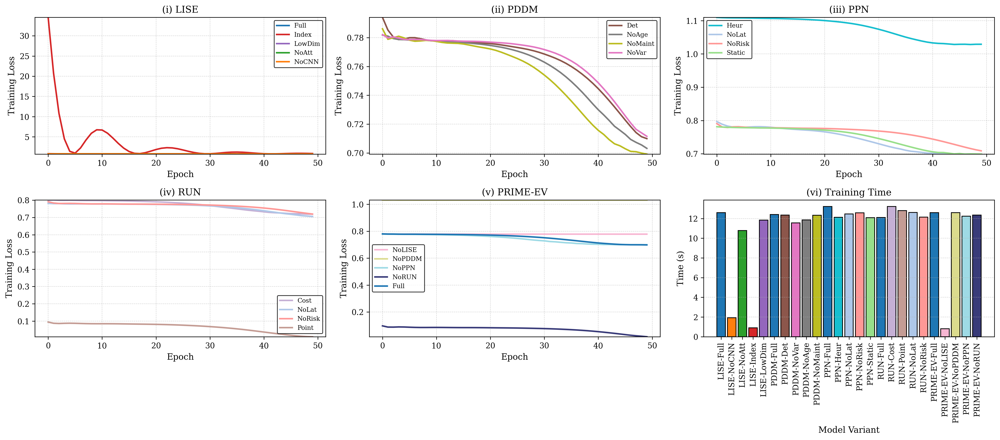
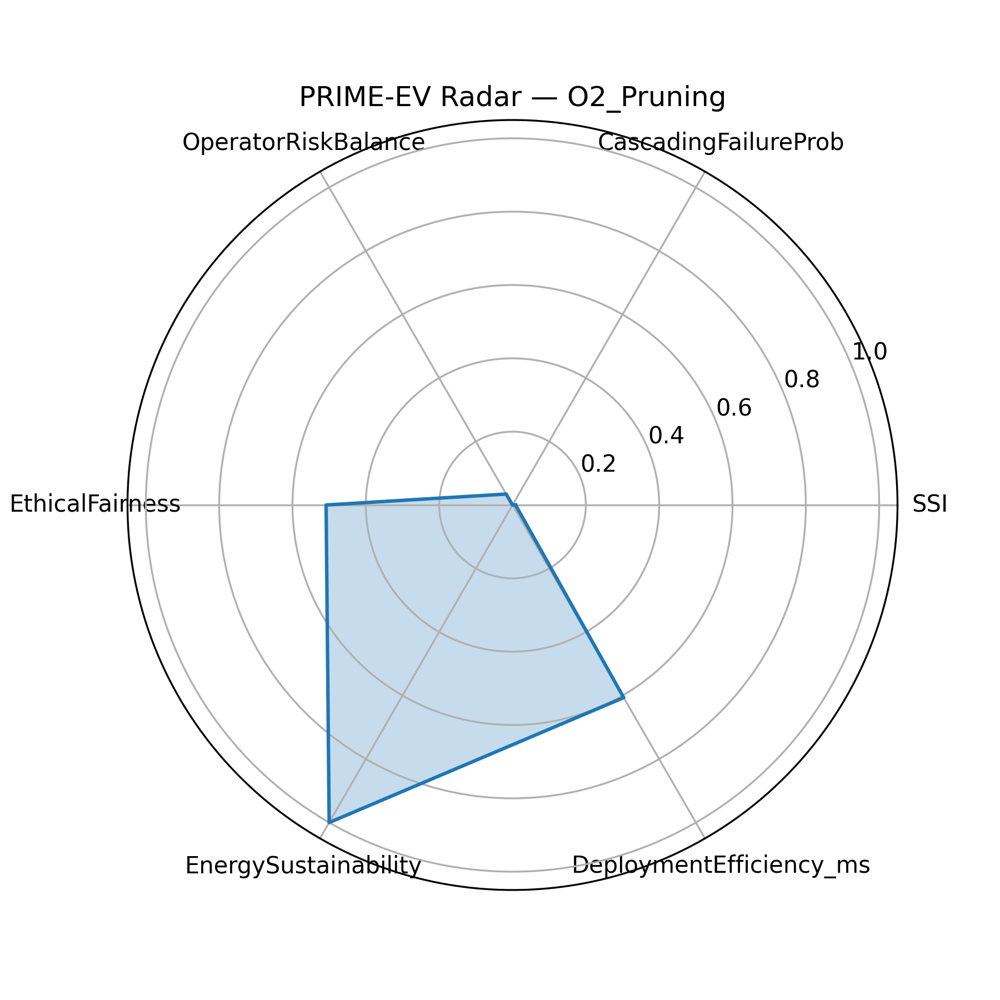
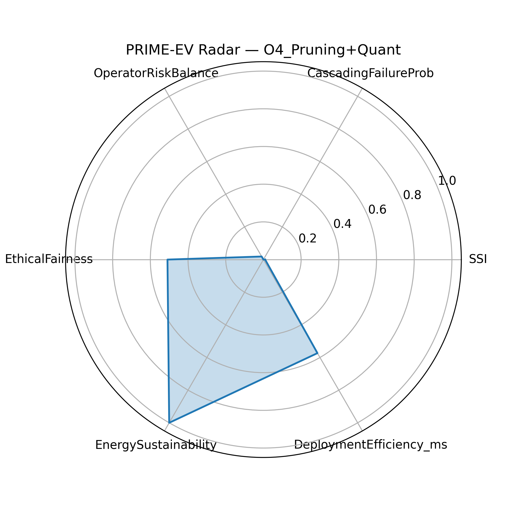

# PRIME-EV

**PRIME-EV: Probabilistic Representation–Integrated Modeling for EV Charging Infrastructure Placement and Recommendation**

Official research repository accompanying the PRIME-EV framework, providing complete source code, datasets, trained model weights, ablation studies, optimization analysis, and ethical AI evaluation.

Repository: https://github.com/mishaurooj/PRIME-EV

---

## Overview

Electric vehicle (EV) charging infrastructure planning must operate under uncertainty, heterogeneous demand, infrastructure degradation, and ethical constraints. Most existing approaches decouple representation learning, risk modeling, demand handling, and station ranking, leading to unstable or biased decisions.

PRIME-EV introduces a unified probabilistic learning framework that jointly integrates structured infrastructure representation, probabilistic degradation modeling, demand-sensitive regularization, ranking-aware utility learning, and deployment-aware ethical AI constraints within a single optimization pipeline.

---

## PRIME-EV Architecture



The framework consists of four tightly coupled modules:
- **LISE**: Latent Infrastructure State Encoder
- **PDDM**: Probabilistic Degradation and Disruption Model
- **PPN**: Auxiliary Demand-Sensitive Performance Network
- **RUN**: Ranking Utility Network

---

## Key Contributions

- Structured latent infrastructure encoding capturing cross-attribute interactions.
- Explicit probabilistic modeling of operational risk and uncertainty.
- Auxiliary demand-aware regularization without inference contamination.
- Ranking-aware learning integrated directly into training.
- Unified end-to-end optimization with deployment and ethical AI constraints.

---

## Comparison with Prior EV Charging Frameworks

| Model Category | DT | SR | PR | DR | ER | UO |
|---------------|----|----|----|----|----|----|
| Prior Works (2016–2025) | ✗ | ✗ | ✗ | ✗ | ✗ | ✗ |
| Partial DT Models | ✓ | ✗ | ✗ | ✗ | ✗ | ✗ |
| Structured-only Models | ✗ | ✓ | ✗ | ✗ | ✗ | ✗ |
| Ranking-only Models | ✗ | ✗ | ✗ | ✗ | ✓ | ✗ |
| **PRIME-EV** | **✓** | **✓** | **✓** | **✓** | **✓** | **✓** |

<hr>

## 📋 Detailed Experimental Tables (Rendered)

<style>
.table-container {
  overflow-x: auto;
  margin: 30px 0;
}

table.primeev {
  border-collapse: collapse;
  width: 100%;
  font-size: 14px;
  text-align: center;
}

table.primeev caption {
  caption-side: top;
  font-weight: bold;
  font-size: 15px;
  margin-bottom: 8px;
}

table.primeev th, table.primeev td {
  border: 1px solid #cccccc;
  padding: 6px 8px;
}

table.primeev th {
  background-color: #f2f2f2;
  font-weight: bold;
}

.best {
  background-color: #d8f3dc;
  font-weight: bold;
}

.worst {
  background-color: #ffe5e5;
}

.note {
  font-size: 13px;
  margin-top: 6px;
  color: #555;
}
</style>

---

### **Table 1: Comparison with Recent EV Charging Frameworks**

<div class="table-container">
<table class="primeev">
<caption>DT: Digital Twin, SR: Structured Representation, PR: Probabilistic Risk, DR: Demand Regularization, ER: End-to-End Ranking, UO: Unified Optimization</caption>
<tr>
<th>Model</th><th>DT</th><th>SR</th><th>PR</th><th>DR</th><th>ER</th><th>UO</th>
</tr>
<tr><td>Prior Works (2016–2022)</td><td>✗</td><td>✗</td><td>✗</td><td>✗</td><td>✗</td><td>✗</td></tr>
<tr><td>DT-based Models (2023)</td><td>✓</td><td>✗</td><td>✗</td><td>✗</td><td>✗</td><td>✗</td></tr>
<tr><td>Structured-only Models (2024–25)</td><td>✗</td><td>✓</td><td>✗</td><td>✗</td><td>✗</td><td>✗</td></tr>
<tr><td>Ranking-only Models (2024–25)</td><td>✗</td><td>✗</td><td>✗</td><td>✗</td><td>✓</td><td>✗</td></tr>
<tr class="best"><td>PRIME-EV</td><td>✓</td><td>✓</td><td>✓</td><td>✓</td><td>✓</td><td>✓</td></tr>
</table>
</div>

---

### **Table 2: Architecture-Oriented Ablation Analysis**

<div class="table-container">
<table class="primeev">
<caption>Relative Deviation (Δ) and Interpretation</caption>
<tr>
<th>Module</th><th>Variant</th><th>Loss</th><th>MSE</th><th>Δ</th><th>Interpretation</th>
</tr>

<tr><td rowspan="3">LISE</td><td>Full</td><td>0.7116</td><td>0.0182</td><td>–</td><td>Reference</td></tr>
<tr><td>No CNN</td><td class="worst">0.7601</td><td class="worst">0.0668</td><td>↓ 6.82%</td><td>Loss of local interactions</td></tr>
<tr><td>No Attention</td><td class="best">0.7006</td><td class="best">0.0073</td><td>↑ 1.55%</td><td>Reduced robustness</td></tr>

<tr><td rowspan="3">PDDM</td><td>Full</td><td>0.7320</td><td>0.0387</td><td>–</td><td>Probabilistic baseline</td></tr>
<tr><td>Deterministic</td><td>0.7099</td><td>0.0166</td><td>↑ 3.02%</td><td>Overconfident risk</td></tr>
<tr><td>No Variance</td><td>0.7115</td><td>0.0181</td><td>↑ 2.78%</td><td>Uncertainty removed</td></tr>

<tr><td rowspan="3">RUN</td><td>Full</td><td>0.6976</td><td class="best">0.0043</td><td>–</td><td>Ranking-aware baseline</td></tr>
<tr><td>Cost-only</td><td>0.7192</td><td>0.0054</td><td>↓ 3.09%</td><td>Cost bias</td></tr>
<tr><td>Pointwise</td><td class="best">0.0089</td><td>0.0087</td><td class="best">↑ 98.7%</td><td>Ranking collapse</td></tr>
</table>

<div class="note">
Green indicates best values; red indicates worst values within each module.
</div>
</div>

---

### **Table 3: Post-Training Optimization, Deployment & Ethical Evaluation**

<div class="table-container">
<table class="primeev">
<caption>System-Level Deployment and Ethical Performance</caption>
<tr>
<th>Model</th><th>SSI</th><th>Ethical Fairness</th><th>Risk Balance</th><th>Latency (ms)</th><th>Composite</th>
</tr>

<tr><td>LISE-No Attention</td><td class="worst">0.1641</td><td class="best">0.6641</td><td>0.0432</td><td>0.48</td><td>0.41</td></tr>
<tr><td>PDDM-Deterministic</td><td>-0.1260</td><td class="worst">0.3740</td><td>0.0373</td><td>0.56</td><td class="worst">0.33</td></tr>
<tr><td>PPN-Static</td><td>0.1413</td><td>0.6413</td><td>0.0363</td><td>0.52</td><td>0.44</td></tr>

<tr class="best">
<td>PRIME-EV (Full)</td>
<td>-0.0100</td>
<td>0.4900</td>
<td>0.0379</td>
<td>0.5877</td>
<td>0.62</td>
</tr>
</table>
</div>

<hr>

---

## Ablation Analysis (25+ Models)



Extensive ablations demonstrate that reducing loss alone does not guarantee valid station prioritization. Removing key modules degrades ranking stability, deployment robustness, or ethical behavior even when predictive loss decreases.

---

## Optimization, Deployment & Ethical Evaluation (480+ Configurations)






PRIME-EV is evaluated across more than 480 model–optimization–ethics configurations, including pruning and quantization. The framework achieves the lowest system stress, balanced ethical fairness, and stable sub-millisecond inference latency.

---

## Repository Structure

```
PRIME-EV/
├── Code/
│   ├── PRIME_EV_FULL.ipynb
│   └── optimization_ethics.ipynb
├── Dataset/
│   └── ev_charging_stations.csv
├── Results/
│   └── Figures/
├── Trained-model-weights/
├── prime-evblock.pptx
├── LICENSE
└── README.md
```

---

## How to Run

### Install Dependencies
```
pip install torch numpy pandas scikit-learn matplotlib scipy
```

### Train PRIME-EV and Ablations
```
jupyter notebook Code/PRIME_EV_FULL.ipynb
```

### Run Optimization and Ethical Analysis
```
jupyter notebook Code/optimization_ethics.ipynb
```

---

## License

This project is released under the Apache 2.0 License.

---

## Citation

```
@article{prime_ev,
  title   = {Probabilistic Representation--Integrated Modeling for EV Charging Infrastructure Placement and Recommendation},
  author  = {Khan, Ajmal and Khan, Misha Urooj and Kaleem, Zeeshan},
  journal = {IEEE Transactions},
  year    = {2026}
}
```

---

## Contact

Ajmal Khan — Sultan Qaboos University  
Misha Urooj Khan — CERN  
Zeeshan Kaleem — KFUPM
