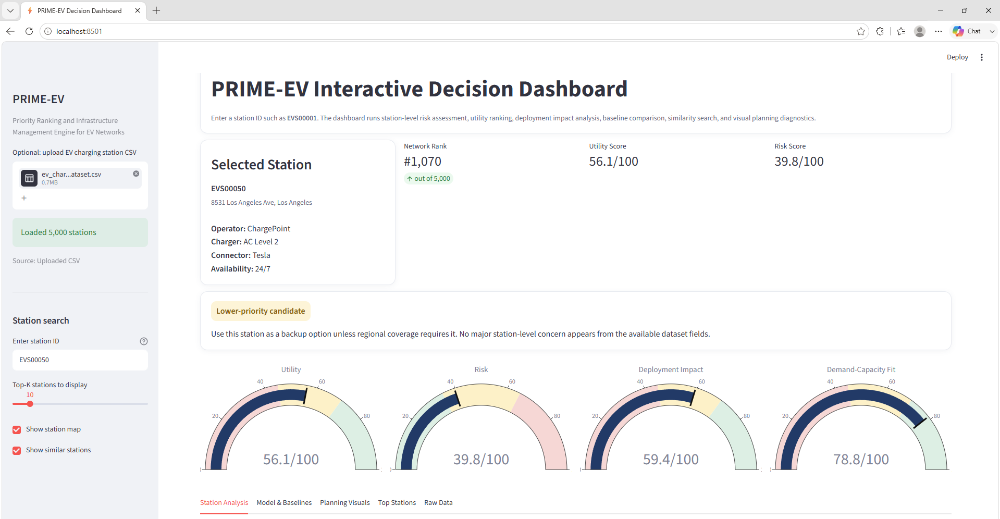
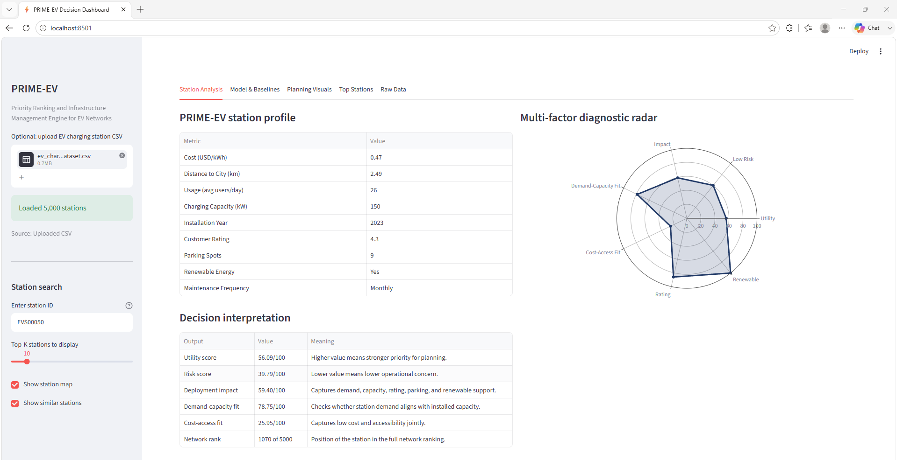
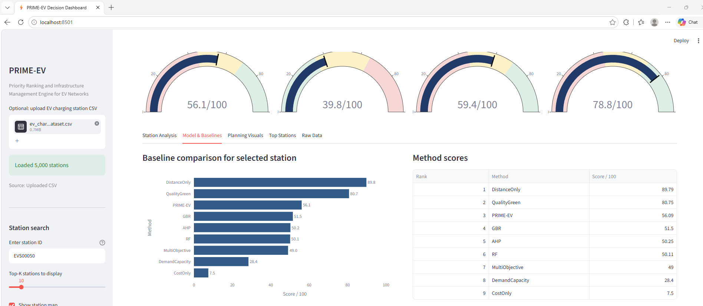
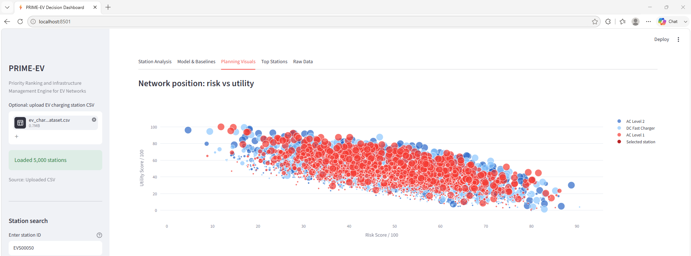
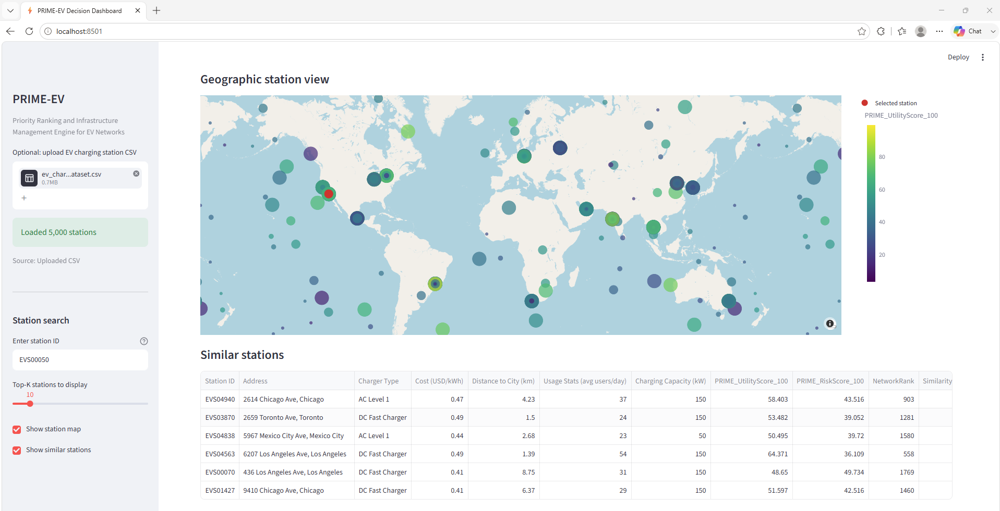
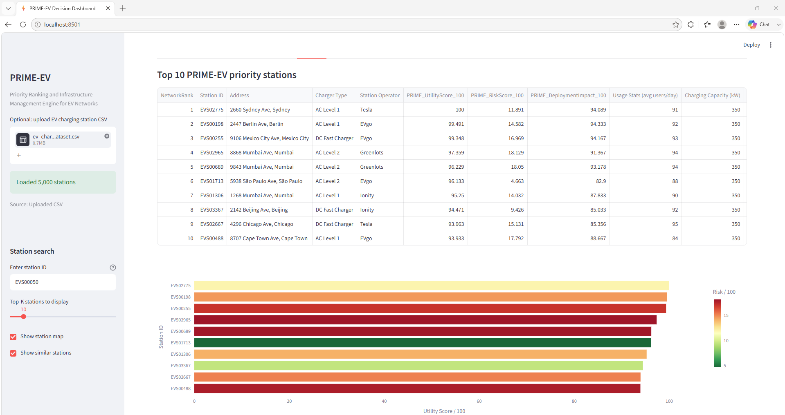
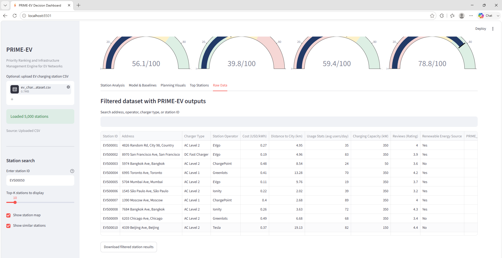
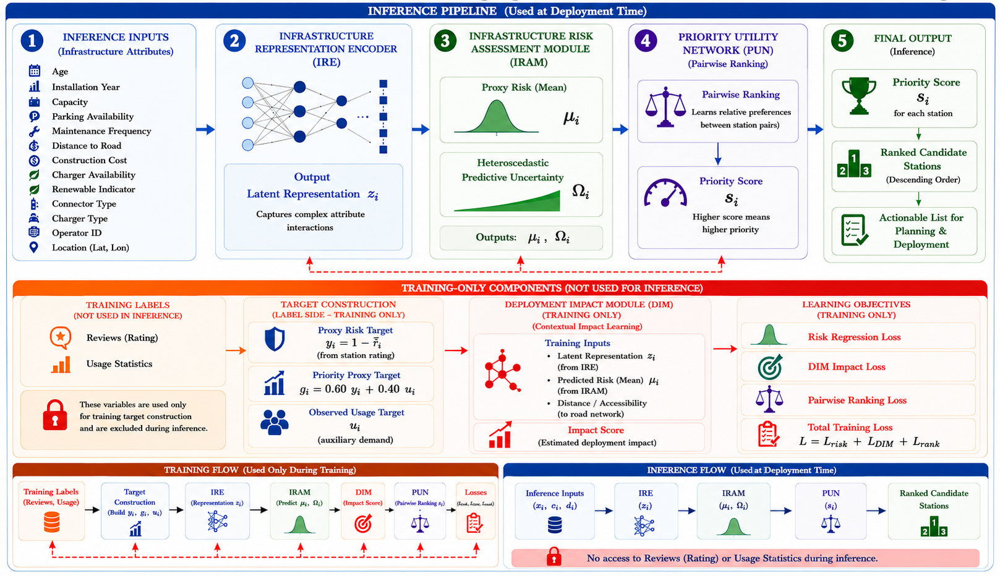

# PRIME-EV

<p align="center">
  
  
  
  
</p>

## PRIME-EV: Priority Ranking and Infrastructure Management Engine for EV Networks

Official research repository for **PRIME-EV**, a decision-support framework for EV charging infrastructure prioritization and planning.

Repository: `https://github.com/mishaurooj/PRIME-EV`

# PRIME-EV Interactive Decision Dashboard

PRIME-EV is an interactive Streamlit dashboard for EV charging station prioritization. It lets you enter a station ID such as `EVS00001` or `EVS00050`, then runs station-level risk assessment, utility ranking, deployment impact analysis, baseline comparison, similarity search, map visualization, and top-priority station screening.

## Dashboard Demonstration

A complete walkthrough of the PRIME-EV Interactive Decision Dashboard is available below.

https://github.com/mishaurooj/PRIME-EV/blob/main/prime-ev-app.mp4

## Dashboard Preview

### 1. Executive Overview



---

### 2. Station Profile and Multi-Factor Diagnostic Radar



---

### 3. Baseline Comparison and Method Scores



---

### 4. Network Position Analysis: Risk versus Utility



---

### 5. Geographic Station Visualization and Similar Stations



---

### 6. Top PRIME-EV Priority Stations



---

### 7. Raw Dataset Exploration and Downloadable Results



---

## Overview

EV charging infrastructure planning requires more than a single prediction score. A planner must rank stations under demand variation, station aging, operator differences, cost, distance, renewable usage, and deployment constraints.

PRIME-EV combines four components in one pipeline:

| Module | Full Name | Role |
|---|---|---|
| **IRE** | Infrastructure Representation Encoder | Learns structured station representations from heterogeneous attributes. |
| **IRAM** | Infrastructure Risk Assessment Module | Estimates station-level operational risk and uncertainty descriptors. |
| **DIM** | Deployment Impact Module | Adds demand-sensitive training regularization. |
| **PUN** | Priority Utility Network | Produces the final station utility score for prioritization. |

---

## Architecture



---

## Key Contributions

- Integrated decision-support architecture for EV charging station prioritization.
- Structured infrastructure representation instead of flat feature-only modeling.
- Risk-aware prioritization using operational risk and uncertainty descriptors.
- Demand-aware training regularization without using the auxiliary output at inference.
- Ranking-aware station utility learning through the Priority Utility Network.
- Evaluation across ranking quality, planning impact, robustness, scalability, transferability, and statistical reliability.

---

## Dataset

This repository uses the public **Global EV Charging Stations Dataset**.

| Attribute Group | Examples |
|---|---|
| Spatial | Location, region, distance indicators |
| Technical | Charger type, capacity, connector type |
| Operational | Usage, availability, installation year |
| Economic | Cost and pricing indicators |
| Sustainability | Renewable energy share |
| User feedback | Ratings and reviews |
| Maintenance | Maintenance frequency and parking capacity |

Dataset source: `https://www.kaggle.com/datasets/vivekattri/global-ev-charging-stations-dataset`

---

## Repository Structure

```text
PRIME-EV/
├── Code/
│   ├── PRIME_EV_FULL.ipynb
│   └── prime_ev_ieee_response_validation.py
├── Dataset/
│   └── ev_charging_stations-dataset.csv
├── Results/
│   ├── Figures/
│   └── Tables/
├── Trained-model-weights/
├── README.md
├── LICENSE
└── prime_ev_architecture_2.png
```

---

## How to Run with Anaconda

### 1. Clone the repository

```bash
git clone https://github.com/mishaurooj/PRIME-EV.git
cd PRIME-EV
```

### 2. Create the environment

```bash
conda create -n prime-ev python=3.10 -y
conda activate prime-ev
```

### 3. Install dependencies

```bash
pip install torch numpy pandas scipy scikit-learn matplotlib seaborn jupyter nbformat
```

### 4. Run the notebook

```bash
jupyter notebook Code/PRIME_EV_FULL.ipynb
```

### 5. Run the validation script

```bash
python Code/prime_ev_ieee_response_validation.py
```

---
## Citation

```bibtex
@article{prime_ev_2026,
  title   = {PRIME-EV: A Multi-Perspective Learning Framework for EV Charging Infrastructure Prioritization and Planning},
  author  = {Khan, Misha Urooj and Alkhrijah, Yazeed and Suleman, Ahmad and Adarbah, Haitham and Zulfiqar, Lubaid},
  journal = {IEEE Open Journal of the Computer Society},
  year    = {2026}
}
```

---

## License

Apache 2.0 License.
