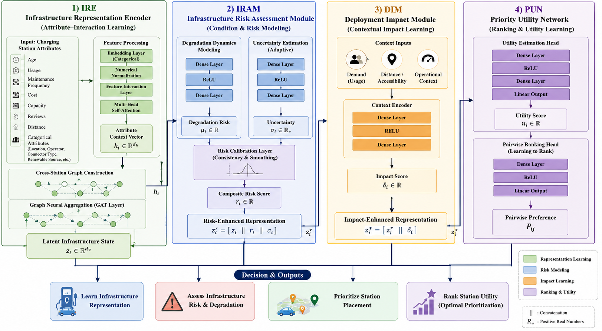

# PRIME-EV

<p align="center">
  
  
  
  
</p>

## PRIME-EV: Priority Ranking and Infrastructure Management Engine for EV Networks

Official research repository for **PRIME-EV**, a decision-support framework for EV charging infrastructure prioritization and planning.

Repository: `https://github.com/mishaurooj/PRIME-EV`

# PRIME-EV Interactive Decision Dashboard

PRIME-EV is an interactive Streamlit dashboard for EV charging station prioritization. It lets you enter a station ID such as `EVS00001` or `EVS00050`, then runs station-level risk assessment, utility ranking, deployment impact analysis, baseline comparison, similarity search, map visualization, and top-priority station screening.

## Dashboard Preview

### 1. Executive Overview


### 2. Station Profile and Diagnostic Radar


### 3. Baseline Comparison


### 4. Risk versus Utility Planning View


### 5. Geographic Station View and Similar Stations


### 6. Top PRIME-EV Priority Stations


### 7. Raw Dataset and Downloadable Results


---

## Overview

EV charging infrastructure planning requires more than a single prediction score. A planner must rank stations under demand variation, station aging, operator differences, cost, distance, renewable usage, and deployment constraints.

PRIME-EV combines four components in one pipeline:

| Module | Full Name | Role |
|---|---|---|
| **IRE** | Infrastructure Representation Encoder | Learns structured station representations from heterogeneous attributes. |
| **IRAM** | Infrastructure Risk Assessment Module | Estimates station-level operational risk and uncertainty descriptors. |
| **DIM** | Deployment Impact Module | Adds demand-sensitive training regularization. |
| **PUN** | Priority Utility Network | Produces the final station utility score for prioritization. |

---

## Architecture



---

## Key Contributions

- Integrated decision-support architecture for EV charging station prioritization.
- Structured infrastructure representation instead of flat feature-only modeling.
- Risk-aware prioritization using operational risk and uncertainty descriptors.
- Demand-aware training regularization without using the auxiliary output at inference.
- Ranking-aware station utility learning through the Priority Utility Network.
- Evaluation across ranking quality, planning impact, robustness, scalability, transferability, and statistical reliability.

---

## Dataset

This repository uses the public **Global EV Charging Stations Dataset**.

| Attribute Group | Examples |
|---|---|
| Spatial | Location, region, distance indicators |
| Technical | Charger type, capacity, connector type |
| Operational | Usage, availability, installation year |
| Economic | Cost and pricing indicators |
| Sustainability | Renewable energy share |
| User feedback | Ratings and reviews |
| Maintenance | Maintenance frequency and parking capacity |

Dataset source: `https://www.kaggle.com/datasets/vivekattri/global-ev-charging-stations-dataset`

---

## Repository Structure

```text
PRIME-EV/
├── Code/
│   ├── PRIME_EV_FULL.ipynb
│   └── prime_ev_ieee_response_validation.py
├── Dataset/
│   └── ev_charging_stations-dataset.csv
├── Results/
│   ├── Figures/
│   └── Tables/
├── Trained-model-weights/
├── README.md
├── LICENSE
└── prime_ev_architecture_2.png
```

---

## How to Run with Anaconda

### 1. Clone the repository

```bash
git clone https://github.com/mishaurooj/PRIME-EV.git
cd PRIME-EV
```

### 2. Create the environment

```bash
conda create -n prime-ev python=3.10 -y
conda activate prime-ev
```

### 3. Install dependencies

```bash
pip install torch numpy pandas scipy scikit-learn matplotlib seaborn jupyter nbformat
```

### 4. Run the notebook

```bash
jupyter notebook Code/PRIME_EV_FULL.ipynb
```

### 5. Run the validation script

```bash
python Code/prime_ev_ieee_response_validation.py
```

Expected outputs:

```text
Results/Tables/
├── Table_H1_full_baseline_metrics.csv
├── Table_H2_ieee_7_perspective_scores.csv
├── Table_H3_downstream_planning_outcomes.csv
├── Table_I_statistical_significance_vs_PRIME_EV.csv
├── Table_J_complexity_scalability_dimensionality.csv
├── Table_K1_cross_region_transferability_detailed.csv
├── Table_K2_cross_region_transferability_summary.csv
├── Table_L_perspective_winners.csv
└── Table_M_reviewer_checklist.csv
```

---

## Quick Result Summary

| Metric | PRIME-EV Result |
|---|---:|
| NDCG@10% | **0.996714** |
| Precision@10% | **0.900000** |
| IEEE 7-Perspective Score | **92.400072** |
| Top-10% Utility | **0.703953** |
| Regret vs. Oracle | **0.002402** |
| Transfer NDCG@10% | **0.996659** |
| Transfer Precision@10% | **0.901283** |
| Runtime Rank | **0.050300 ms** |

---

## Color Legend

| Marker | Meaning |
|---|---|
| 🟢 | Best or strongest value in the reported comparison |
| 🔴 | Weakest or failure-case value in the reported comparison |
| 🟡 | Important caution or trade-off |
| 🔵 | PRIME-EV result |

---

# Complete Experimental Tables

The following tables preserve the full uploaded results. No rows or columns from the uploaded CSV result files are omitted.


## Table A. Architecture-Oriented Ablation Analysis


| Group    | Variant   |     Loss |      MSE |      DIM |      PUN | DeltaPred_%   | DCD_%   | Interpretation                   |
|:---------|:----------|---------:|---------:|---------:|---------:|:--------------|:--------|:---------------------------------|
| IRE      | Full      | 0.711622 | 0.018245 | 0.000184 | 0.693193 | --            | --      | Reference representation         |
| IRE      | NoCNN     | 0.760114 | 0.066829 | 0.00012  | 0.693165 | -6.82         | -0.004  | Loss of local interactions       |
| IRE      | NoAtt     | 0.700607 | 0.007376 | 6.8e-05  | 0.693163 | +1.55         | -0.004  | Less robust feature weighting    |
| IRE      | Index     | 0.861112 | 0.088141 | 0.079806 | 0.693165 | -21.0         | -0.004  | Static encoding insufficient     |
| IRE      | LowDim    | 0.774914 | 0.081638 | 0.000109 | 0.693166 | -8.87         | -0.004  | Underfitting due to low capacity |
| IRAM     | Full      | 0.732011 | 0.038711 | 0.000139 | 0.69316  | --            | --      | Probabilistic baseline           |
| IRAM     | Det       | 0.709938 | 0.016616 | 0.000155 | 0.693167 | +3.02         | +0.001  | Overconfident deterministic risk |
| IRAM     | NoVar     | 0.711536 | 0.018141 | 0.000198 | 0.693196 | +2.78         | +0.005  | Uncertainty removed              |
| IRAM     | NoAge     | 0.703181 | 0.009854 | 0.000162 | 0.693165 | +3.95         | +0.001  | Aging stabilizes estimates       |
| IRAM     | NoMaint   | 0.699179 | 0.005907 | 9.4e-05  | 0.693178 | +4.48         | +0.003  | Maintenance signal relevant      |
| DIM      | Full      | 0.741788 | 0.048514 | 0.000104 | 0.69317  | --            | --      | Learned placement baseline       |
| DIM      | Heur      | 1.02898  | 0.005567 | 0.330235 | 0.693181 | -38.7         | +0.002  | Heuristic destabilization        |
| DIM      | NoRisk    | 0.7089   | 0.0156   | 0.000125 | 0.693175 | +4.44         | +0.001  | Risk-unaware placement           |
| DIM      | NoLat     | 0.699199 | 0.005739 | 0.000297 | 0.693163 | +5.75         | -0.001  | Myopic placement                 |
| DIM      | Static    | 0.699057 | 0.005863 | 0        | 0.693194 | +5.77         | +0.004  | No adaptability                  |
| PUN      | Full      | 0.697657 | 0.004336 | 0.000154 | 0.693168 | --            | --      | Ranking-aware baseline           |
| PUN      | Cost      | 0.719202 | 0.005485 | 0.000169 | 0.713548 | -3.09         | +2.94   | Cost-only bias                   |
| PUN      | NoRisk    | 0.719863 | 0.026562 | 9.7e-05  | 0.693204 | -3.18         | +0.005  | Reliability ignored              |
| PUN      | NoLat     | 0.705908 | 0.012646 | 0.000111 | 0.693151 | -1.18         | -0.002  | Context removed                  |
| PUN      | Point     | 0.008983 | 0.008709 | 0.000193 | 8e-05    | +98.7         | -99.99  | Ranking objective collapsed      |
| PRIME-EV | NoIRE     | 0.778014 | 0.084858 | 8e-06    | 0.693147 | -3.11         | -0.004  | Representation critical          |
| PRIME-EV | NoIRAM    | 1.03062  | 0.337465 | 8e-06    | 0.693148 | -36.6         | -0.003  | Risk modeling essential          |
| PRIME-EV | NoDIM     | 0.699316 | 0.006149 | 0        | 0.693167 | +7.29         | -0.001  | Regularization removed           |
| PRIME-EV | NoPUN     | 0.016105 | 0.015908 | 0.000197 | 0        | +97.9         | -100.0  | Objective eliminated             |
| PRIME-EV | Full      | 0.754628 | 0.061346 | 0.00011  | 0.693172 | --            | --      | Balanced PRIME-EV                |


## Table B. Post-Training Optimization, Deployment Feasibility, and Ethical Evaluation


| Module   | Variant        |     SSI |   CFP |   RiskBalance |   EthicalFairness |   EnergySustainability |   DeployTime_ms |   CompositeScore |
|:---------|:---------------|--------:|------:|--------------:|------------------:|-----------------------:|----------------:|-----------------:|
| IRE      | Full           |  0.0046 |     0 |        0.0358 |            0.5046 |                 1      |          0.5107 |             0.56 |
| IRE      | No CNN         |  0.002  |     0 |        0.0397 |            0.502  |                 1      |          0.5451 |             0.55 |
| IRE      | No Attention   |  0.1641 |     0 |        0.0432 |            0.6641 |                 0.9983 |          0.4797 |             0.41 |
| IRE      | No Indexing    | -0.0759 |     0 |        0.0455 |            0.4241 |                 1      |          0.6495 |             0.47 |
| IRE      | Low Dimension  | -0.0646 |     0 |        0.0523 |            0.4354 |                 1      |          0.5544 |             0.48 |
| IRAM     | Full           |  0.0184 |     0 |        0.0381 |            0.5184 |                 1      |          0.4907 |             0.57 |
| IRAM     | Deterministic  | -0.126  |     0 |        0.0373 |            0.374  |                 1      |          0.5574 |             0.33 |
| IRAM     | No Variance    |  0.0572 |     0 |        0.0339 |            0.5572 |                 1      |          0.5976 |             0.52 |
| IRAM     | No Age         |  0.0701 |     0 |        0.0316 |            0.5701 |                 1      |          0.4886 |             0.55 |
| IRAM     | No Maintenance | -0.0586 |     0 |        0.0394 |            0.4414 |                 1      |          0.5529 |             0.46 |
| DIM      | Full           |  0.0108 |     0 |        0.0384 |            0.5108 |                 1      |          0.4441 |             0.58 |
| DIM      | Heuristic      | -0.0893 |     0 |        0.0339 |            0.4107 |                 1      |          0.4614 |             0.39 |
| DIM      | No Latent      |  0.1043 |     0 |        0.0383 |            0.6043 |                 1      |          0.8398 |             0.45 |
| DIM      | No Risk        |  0.1198 |     0 |        0.0344 |            0.6198 |                 1      |          0.533  |             0.49 |
| DIM      | Static         |  0.1413 |     0 |        0.0363 |            0.6413 |                 1      |          0.5217 |             0.44 |
| PUN      | Full           | -0.037  |     0 |        0.0334 |            0.463  |                 1      |          0.6128 |             0.51 |
| PUN      | Cost Only      |  0.1336 |     0 |        0.0456 |            0.6336 |                 1      |          0.4902 |             0.46 |
| PUN      | Pointwise      |  0.0884 |     0 |        0.0516 |            0.5884 |                 1      |          0.6044 |             0.48 |
| PUN      | No Latency     |  0.1186 |     0 |        0.0138 |            0.6186 |                 1      |          0.5629 |             0.52 |
| PUN      | No Risk        | -0.0244 |     0 |        0.0402 |            0.4756 |                 1      |          0.7695 |             0.47 |
| PRIME-EV | Full           | -0.01   |     0 |        0.0379 |            0.49   |                 1      |          0.5877 |             0.62 |
| PRIME-EV | No IRE         | -0.1457 |     0 |        0.0483 |            0.3543 |                 1      |          0.7448 |             0.29 |
| PRIME-EV | No IRAM        |  0.0082 |     0 |        0.0342 |            0.5082 |                 1      |          0.6436 |             0.54 |
| PRIME-EV | No DIM         | -0.0824 |     0 |        0.0368 |            0.4176 |                 1      |          0.5597 |             0.42 |
| PRIME-EV | No PUN         | -0.0226 |     0 |        0.0391 |            0.4774 |                 1      |          0.6123 |             0.5  |


<details open>
<summary><strong>Table H1 full baseline metrics</strong></summary>


| Method                            | Family         | IsUpperBound   |   NDCG@5% |   NDCG@10% |   NDCG@20% |   Precision@10% |   Recall@10% |   Spearman |   KendallTau |   PairwiseAccuracy |   NoiseKendallStability |   Bootstrap_NDCG@10%_Std |   RuntimeRank_ms |   Top10_AvgUtility |   Top10_Regret_vs_Oracle |   Top10_AvgUsage |   Top10_AvgCapacity |   Top10_AvgRating |   Top10_AvgCost |   Top10_AvgDistance |   Top10_RenewableShare |   Top10_DemandCapacityFit |   CongestionProxy_users_per_kW |   CongestionProxy_RelativeToRandom |   Transfer_NDCG@10% |   Transfer_Precision@10% |   Transfer_Spearman |   Transfer_KendallTau |   P1_RankingFidelity_100 |   P2_PlanningImpact_100 |   P3_OperationalImpact_100 |   P4_Robustness_100 |   P5_Scalability_100 |   P6_Transferability_100 |   P7_StatisticalReliability_100 |   IEEE_7PerspectiveScore_100 |
|:----------------------------------|:---------------|:---------------|----------:|-----------:|-----------:|----------------:|-------------:|-----------:|-------------:|-------------------:|------------------------:|-------------------------:|-----------------:|-------------------:|-------------------------:|-----------------:|--------------------:|------------------:|----------------:|--------------------:|-----------------------:|--------------------------:|-------------------------------:|-----------------------------------:|--------------------:|-------------------------:|--------------------:|----------------------:|-------------------------:|------------------------:|---------------------------:|--------------------:|---------------------:|-------------------------:|--------------------------------:|-----------------------------:|
| PRIME-EV                          | Proposed       | False          |  0.996628 |   0.996714 |   0.996503 |           0.9   |        0.9   |   0.938631 |     0.794392 |           0.887667 |                0.980785 |                 0.001326 |         0.0503   |           0.703953 |                 0.002402 |           77.302 |             304     |            4.282  |         0.26114 |             8.71654 |                  0.754 |                  0.777681 |                       0.280611 |                           0.249271 |            0.996659 |                 0.901283 |            0.938783 |              0.794822 |                  95.7844 |                 88.533  |                    81.996  |             97.354  |              98.999  |                  95.7437 |                         95.1085 |                      92.4001 |
| GradientBoostedRanker             | MLRanker       | False          |  0.985963 |   0.98976  |   0.990526 |           0.852 |        0.852 |   0.953823 |     0.814725 |           0.907969 |                0.980977 |                 0.004364 |         0.053857 |           0.700266 |                 0.006089 |           78.368 |             319.6   |            4.2592 |         0.26536 |             8.4108  |                  0.712 |                  0.747834 |                       0.267878 |                           0.23796  |            0.989392 |                 0.846274 |            0.954911 |              0.817691 |                  94.7382 |                 87.142  |                    82.2043 |             94.1658 |              98.9286 |                  94.3171 |                         90.8942 |                      90.9181 |
| AHP                               | MCDM           | False          |  0.993584 |   0.990268 |   0.985552 |           0.826 |        0.826 |   0.871813 |     0.691825 |           0.843    |                0.981042 |                 0.002024 |         0.047143 |           0.698741 |                 0.007615 |           79.078 |             300.128 |            4.3488 |         0.25168 |             7.67028 |                  0.712 |                  0.672685 |                       0.429212 |                           0.381275 |            0.989985 |                 0.819519 |            0.871055 |              0.691177 |                  92.7959 |                 86.1297 |                    79.6608 |             96.6356 |              99.0616 |                  92.2038 |                         92.6678 |                      90.1629 |
| RandomForestRanker                | MLRanker       | False          |  0.968857 |   0.979811 |   0.983995 |           0.804 |        0.804 |   0.941448 |     0.790416 |           0.88963  |                0.980085 |                 0.004966 |         0.048057 |           0.695047 |                 0.011308 |           82.556 |             324     |            4.1538 |         0.28896 |             9.01584 |                  0.63  |                  0.801082 |                       0.272674 |                           0.242221 |            0.980596 |                 0.796999 |            0.942321 |              0.792531 |                  92.8673 |                 86.1211 |                    81.6501 |             93.4733 |              99.0435 |                  92.4377 |                         89.366  |                      89.7939 |
| MultiObjective_WeightedSum        | MultiObjective | False          |  0.989832 |   0.987983 |   0.984095 |           0.804 |        0.804 |   0.891755 |     0.714679 |           0.864333 |                0.981139 |                 0.003936 |         0.048757 |           0.697225 |                 0.00913  |           75.784 |             309.04  |            4.3198 |         0.2461  |             7.29336 |                  0.716 |                  0.659072 |                       0.3739   |                           0.332141 |            0.987606 |                 0.802404 |            0.891333 |              0.714354 |                  92.5901 |                 85.7247 |                    80.2331 |             94.6269 |              99.0296 |                  91.9875 |                         90.2863 |                      89.6036 |
| TOPSIS                            | MCDM           | False          |  0.988888 |   0.988814 |   0.978972 |           0.826 |        0.826 |   0.742637 |     0.560911 |           0.782    |                0.98078  |                 0.003451 |         0.047086 |           0.697923 |                 0.008432 |           82.12  |             322.8   |            4.2856 |         0.2677  |             8.37632 |                  0.558 |                  0.745918 |                       0.281722 |                           0.250258 |            0.989239 |                 0.833016 |            0.741196 |              0.55979  |                  90.7462 |                 86.1101 |                    80.6771 |             95.1147 |              99.0627 |                  90.5521 |                         88.83   |                      89.1535 |
| VIKOR                             | MCDM           | False          |  0.983968 |   0.984632 |   0.979006 |           0.794 |        0.794 |   0.814447 |     0.627543 |           0.827333 |                0.979997 |                 0.00615  |         0.048986 |           0.694815 |                 0.01154  |           81.18  |             309.2   |            4.3212 |         0.26732 |             8.25472 |                  0.614 |                  0.723788 |                       0.299836 |                           0.266349 |            0.984823 |                 0.792466 |            0.814277 |              0.627727 |                  90.9844 |                 85.5379 |                    80.8264 |             92.2207 |              99.0251 |                  90.4101 |                         85.9026 |                      88.3918 |
| RidgeLinearRanker                 | MLRanker       | False          |  0.97541  |   0.97575  |   0.980574 |           0.732 |        0.732 |   0.913072 |     0.743816 |           0.875625 |                0.981211 |                 0.005017 |         0.048829 |           0.688279 |                 0.018076 |           70.58  |             302.016 |            4.3592 |         0.24124 |             6.8336  |                  0.784 |                  0.608847 |                       0.392355 |                           0.348535 |            0.976025 |                 0.733016 |            0.912924 |              0.743782 |                  90.8676 |                 83.8678 |                    78.5174 |             93.4924 |              99.0282 |                  90.0947 |                         88.8532 |                      88.0798 |
| Pareto_BalancedSort               | MultiObjective | False          |  0.965702 |   0.961118 |   0.96481  |           0.612 |        0.612 |   0.838539 |     0.64347  |           0.817333 |                0.980529 |                 0.006294 |         0.049714 |           0.677133 |                 0.029222 |           71.442 |             226.992 |            4.4088 |         0.22488 |             6.47186 |                  0.728 |                  0.741369 |                       0.500574 |                           0.444667 |            0.961903 |                 0.608014 |            0.838557 |              0.643871 |                  86.4577 |                 84.3148 |                    74.2153 |             92.1033 |              99.0106 |                  85.0909 |                         85.0807 |                      85.3066 |
| DemandCapacityHeuristic           | Heuristic      | False          |  0.929416 |   0.948729 |   0.933971 |           0.682 |        0.682 |   0.537134 |     0.377935 |           0.687563 |                0.981853 |                 0.00579  |         0.050343 |           0.679363 |                 0.026992 |           82.92  |             350     |            4.0114 |         0.2935  |            10.3552  |                  0.5   |                  0.810222 |                       0.236914 |                           0.210455 |            0.948117 |                 0.682098 |            0.535559 |              0.377013 |                  82.6428 |                 82.7465 |                    79.3586 |             92.7207 |              98.9982 |                  81.9584 |                         81.8244 |                      84.5983 |
| WASPAS                            | MCDM           | False          |  0.962049 |   0.953441 |   0.947321 |           0.586 |        0.586 |   0.838383 |     0.645698 |           0.818273 |                0.977832 |                 0.012083 |         0.0476   |           0.670278 |                 0.036077 |           72.28  |             268     |            4.2486 |         0.26756 |             8.49456 |                  1     |                  0.617073 |                       0.396728 |                           0.352419 |            0.95425  |                 0.588535 |            0.838943 |              0.646407 |                  85.6289 |                 81.1138 |                    76.9222 |             85.829  |              99.0525 |                  84.2761 |                         75.9539 |                      83.1669 |
| SAW_EqualWeights                  | MCDM           | False          |  0.941429 |   0.943779 |   0.957039 |           0.56  |        0.56  |   0.851763 |     0.660479 |           0.819    |                0.981318 |                 0.013549 |         0.0496   |           0.666386 |                 0.039969 |           68.196 |             249.448 |            4.3108 |         0.24194 |             7.25068 |                  0.89  |                  0.57158  |                       0.648694 |                           0.576245 |            0.943624 |                 0.555296 |            0.851474 |              0.660353 |                  84.6393 |                 79.9174 |                    71.3356 |             84.5105 |              99.0129 |                  83.162  |                         74.0078 |                      81.227  |
| ShallowTreeRanker                 | MLRanker       | False          |  0.848364 |   0.906996 |   0.925196 |           0.59  |        0.59  |   0.732242 |     0.542425 |           0.769256 |                0.938607 |                 0.023288 |         0.041186 |           0.65729  |                 0.049065 |           77.476 |             350     |            4.014  |         0.29792 |            10.5556  |                  0.492 |                  0.749733 |                       0.22136  |                           0.196637 |            0.901537 |                 0.586083 |            0.73348  |              0.543497 |                  80.8206 |                 77.9678 |                    77.8483 |             71.4738 |              99.1797 |                  80.2735 |                         57.3103 |                      77.4937 |
| QualityGreenHeuristic             | Heuristic      | False          |  0.775143 |   0.813515 |   0.851845 |           0.224 |        0.224 |   0.511654 |     0.356741 |           0.664333 |                0.982242 |                 0.01517  |         0.050029 |           0.585629 |                 0.120727 |           54.724 |             142.344 |            4.7346 |         0.29728 |            10.394   |                  1     |                  0.579731 |                       1.0263   |                           0.911682 |            0.807444 |                 0.219185 |            0.511817 |              0.357453 |                  66.023  |                 66.728  |                    53.5365 |             82.8631 |              99.0044 |                  63.72   |                         65.0722 |                      68.4349 |
| CostAccessHeuristic               | Heuristic      | False          |  0.768015 |   0.800312 |   0.836888 |           0.22  |        0.22  |   0.42601  |     0.292863 |           0.63988  |                0.981621 |                 0.019876 |         0.046171 |           0.575985 |                 0.13037  |           55.342 |             144.824 |            4.0358 |         0.16064 |             3.53348 |                  0.524 |                  0.5648   |                       1.04073  |                           0.9245   |            0.796592 |                 0.221357 |            0.430419 |              0.296329 |                  64.2899 |                 64.2339 |                    56.5307 |             77.8639 |              99.0808 |                  62.1664 |                         57.0028 |                      66.4983 |
| CapacityOnly                      | Heuristic      | False          |  0.744778 |   0.796093 |   0.853347 |           0.316 |        0.316 |   0.512171 |     0.397624 |           0.559    |                0.866038 |                 0.030864 |         0.0087   |           0.57763  |                 0.128725 |           55.832 |             350     |            3.958  |         0.2944  |            10.3812  |                  0.518 |                  0.509244 |                       0.15952  |                           0.141704 |            0.791832 |                 0.307403 |            0.513375 |              0.398737 |                  66.4793 |                 60.8352 |                    69.0905 |             58.775  |              99.8262 |                  65.4449 |                         38.8552 |                      64.5946 |
| DistanceOnly                      | Heuristic      | False          |  0.726012 |   0.759716 |   0.807559 |           0.15  |        0.15  |   0.331686 |     0.223741 |           0.604868 |                0.980953 |                 0.027509 |         0.051857 |           0.547743 |                 0.158612 |           55.664 |             141.488 |            3.9836 |         0.30798 |             1.43712 |                  0.49  |                  0.572043 |                       1.04979  |                           0.932544 |            0.753126 |                 0.14733  |            0.335078 |              0.22634  |                  59.6109 |                 56.5076 |                    58.4443 |             69.779  |              98.9682 |                  57.0564 |                         43.9066 |                      61.4353 |
| CostOnly                          | Heuristic      | False          |  0.715884 |   0.742699 |   0.790705 |           0.164 |        0.164 |   0.274515 |     0.186652 |           0.592333 |                0.985596 |                 0.026088 |         0.038129 |           0.534343 |                 0.172012 |           55.384 |             140.104 |            4.0164 |         0.11992 |            10.3426  |                  0.49  |                  0.562595 |                       1.09054  |                           0.968745 |            0.739852 |                 0.159646 |            0.275717 |              0.187601 |                  58.4665 |                 57.8409 |                    47.5538 |             71.5774 |              99.2403 |                  55.9797 |                         45.3098 |                      59.7735 |
| RatingOnly                        | Heuristic      | False          |  0.731445 |   0.769855 |   0.814247 |           0.188 |        0.188 |   0.353    |     0.245099 |           0.603535 |                0.975342 |                 0.031424 |         0.0448   |           0.554277 |                 0.152078 |           55.574 |             141.056 |            4.905  |         0.30196 |            10.2296  |                  0.528 |                  0.577188 |                       1.02082  |                           0.90681  |            0.764216 |                 0.189754 |            0.352007 |              0.244234 |                  61.0673 |                 59.7965 |                    49.1669 |             65.29   |              99.108  |                  58.8748 |                         38.1484 |                      59.6882 |
| RenewableOnly                     | Heuristic      | False          |  0.69531  |   0.733511 |   0.787133 |           0.134 |        0.134 |   0.368461 |     0.300877 |           0.371457 |                0.706931 |                 0.023724 |         0.007429 |           0.531767 |                 0.174589 |           52.966 |             153.016 |            3.9702 |         0.29874 |            10.4108  |                  1     |                  0.586834 |                       0.934481 |                           0.830114 |            0.729836 |                 0.134851 |            0.367785 |              0.300388 |                  57.4077 |                 56.2609 |                    54.8901 |             55.9552 |              99.8515 |                  56.3937 |                         43.2572 |                      58.363  |
| Random                            | Heuristic      | False          |  0.660043 |   0.694562 |   0.738676 |           0.114 |        0.114 |   0.008887 |     0.006055 |           0.502    |                0.980656 |                 0.018773 |         0.0511   |           0.502784 |                 0.203572 |           55.844 |             154.696 |            4.0012 |         0.30024 |             9.92548 |                  0.506 |                  0.571506 |                       0.97737  |                           0.868212 |            0.688342 |                 0.109881 |            0.0079   |              0.005324 |                  51.5972 |                 49.2169 |                    50.7171 |             78.9632 |              98.9832 |                  48.828  |                         52.7606 |                      58.3057 |
| DemandOnly                        | Heuristic      | False          |  0.706664 |   0.748048 |   0.798835 |           0.252 |        0.252 |   0.291086 |     0.202335 |           0.595667 |                0.984604 |                 0.03322  |         0.047271 |           0.53998  |                 0.166375 |           96.182 |             141.088 |            4.0106 |         0.30086 |             9.97104 |                  0.506 |                  0.383629 |                       1.83216  |                           1.62753  |            0.737777 |                 0.24085  |            0.28674  |              0.199366 |                  60.4948 |                 52.4492 |                    43.9226 |             63.9993 |              99.059  |                  58.0854 |                         34.8625 |                      56.6906 |
| KMeansRepresentative              | Heuristic      | False          |  0.629252 |   0.666112 |   0.712903 |           0.04  |        0.04  |  -0.103543 |    -0.069241 |           0.468667 |                0.981261 |                 0.019724 |         0.052957 |           0.479514 |                 0.226841 |           52.272 |             109.656 |            4.0018 |         0.29934 |            10.0509  |                  0.502 |                  0.609284 |                       1.11125  |                           0.98714  |            0.660484 |                 0.039619 |           -0.105135 |             -0.070291 |                  47.2732 |                 48.4405 |                    45.491  |             78.0008 |              98.9464 |                  44.3094 |                         49.8518 |                      55.3819 |
| OldestFirst                       | Heuristic      | False          |  0.631922 |   0.673554 |   0.722392 |           0.104 |        0.104 |  -0.072876 |    -0.050476 |           0.411333 |                0.963645 |                 0.025257 |         0.0141   |           0.490628 |                 0.215727 |           58.356 |             144.592 |            3.9586 |         0.2927  |            10.0001  |                  0.548 |                  0.580486 |                       1.05635  |                           0.938376 |            0.679072 |                 0.110573 |           -0.074322 |             -0.05143  |                  48.8909 |                 48.8675 |                    50.3258 |             71.0267 |              99.7184 |                  47.3222 |                         40.3285 |                      55.2029 |
| Oracle_WeightedUtility_UpperBound | UpperBound     | True           |  1        |   1        |   1        |           1     |        1     |   1        |     1        |           1        |                0.980191 |                 0        |         0.053043 |           0.706355 |                 0        |           78.918 |             308.544 |            4.2648 |         0.25618 |             8.02824 |                  0.694 |                  0.767972 |                       0.290892 |                           0.258404 |            0.922581 |                 0.57069  |            0.634519 |              0.471117 |                 100      |                 88.6023 |                    82.687  |             98.7124 |              98.9448 |                  79.4841 |                        100      |                      91.2849 |


</details>


<details open>
<summary><strong>Table H2 ieee 7 perspective scores</strong></summary>


| Method                            | Family         | IsUpperBound   |   P1_RankingFidelity_100 |   P2_PlanningImpact_100 |   P3_OperationalImpact_100 |   P4_Robustness_100 |   P5_Scalability_100 |   P6_Transferability_100 |   P7_StatisticalReliability_100 |   IEEE_7PerspectiveScore_100 |
|:----------------------------------|:---------------|:---------------|-------------------------:|------------------------:|---------------------------:|--------------------:|---------------------:|-------------------------:|--------------------------------:|-----------------------------:|
| PRIME-EV                          | Proposed       | False          |                  95.7844 |                 88.533  |                    81.996  |             97.354  |              98.999  |                  95.7437 |                         95.1085 |                      92.4001 |
| GradientBoostedRanker             | MLRanker       | False          |                  94.7382 |                 87.142  |                    82.2043 |             94.1658 |              98.9286 |                  94.3171 |                         90.8942 |                      90.9181 |
| AHP                               | MCDM           | False          |                  92.7959 |                 86.1297 |                    79.6608 |             96.6356 |              99.0616 |                  92.2038 |                         92.6678 |                      90.1629 |
| RandomForestRanker                | MLRanker       | False          |                  92.8673 |                 86.1211 |                    81.6501 |             93.4733 |              99.0435 |                  92.4377 |                         89.366  |                      89.7939 |
| MultiObjective_WeightedSum        | MultiObjective | False          |                  92.5901 |                 85.7247 |                    80.2331 |             94.6269 |              99.0296 |                  91.9875 |                         90.2863 |                      89.6036 |
| TOPSIS                            | MCDM           | False          |                  90.7462 |                 86.1101 |                    80.6771 |             95.1147 |              99.0627 |                  90.5521 |                         88.83   |                      89.1535 |
| VIKOR                             | MCDM           | False          |                  90.9844 |                 85.5379 |                    80.8264 |             92.2207 |              99.0251 |                  90.4101 |                         85.9026 |                      88.3918 |
| RidgeLinearRanker                 | MLRanker       | False          |                  90.8676 |                 83.8678 |                    78.5174 |             93.4924 |              99.0282 |                  90.0947 |                         88.8532 |                      88.0798 |
| Pareto_BalancedSort               | MultiObjective | False          |                  86.4577 |                 84.3148 |                    74.2153 |             92.1033 |              99.0106 |                  85.0909 |                         85.0807 |                      85.3066 |
| DemandCapacityHeuristic           | Heuristic      | False          |                  82.6428 |                 82.7465 |                    79.3586 |             92.7207 |              98.9982 |                  81.9584 |                         81.8244 |                      84.5983 |
| WASPAS                            | MCDM           | False          |                  85.6289 |                 81.1138 |                    76.9222 |             85.829  |              99.0525 |                  84.2761 |                         75.9539 |                      83.1669 |
| SAW_EqualWeights                  | MCDM           | False          |                  84.6393 |                 79.9174 |                    71.3356 |             84.5105 |              99.0129 |                  83.162  |                         74.0078 |                      81.227  |
| ShallowTreeRanker                 | MLRanker       | False          |                  80.8206 |                 77.9678 |                    77.8483 |             71.4738 |              99.1797 |                  80.2735 |                         57.3103 |                      77.4937 |
| QualityGreenHeuristic             | Heuristic      | False          |                  66.023  |                 66.728  |                    53.5365 |             82.8631 |              99.0044 |                  63.72   |                         65.0722 |                      68.4349 |
| CostAccessHeuristic               | Heuristic      | False          |                  64.2899 |                 64.2339 |                    56.5307 |             77.8639 |              99.0808 |                  62.1664 |                         57.0028 |                      66.4983 |
| CapacityOnly                      | Heuristic      | False          |                  66.4793 |                 60.8352 |                    69.0905 |             58.775  |              99.8262 |                  65.4449 |                         38.8552 |                      64.5946 |
| DistanceOnly                      | Heuristic      | False          |                  59.6109 |                 56.5076 |                    58.4443 |             69.779  |              98.9682 |                  57.0564 |                         43.9066 |                      61.4353 |
| CostOnly                          | Heuristic      | False          |                  58.4665 |                 57.8409 |                    47.5538 |             71.5774 |              99.2403 |                  55.9797 |                         45.3098 |                      59.7735 |
| RatingOnly                        | Heuristic      | False          |                  61.0673 |                 59.7965 |                    49.1669 |             65.29   |              99.108  |                  58.8748 |                         38.1484 |                      59.6882 |
| RenewableOnly                     | Heuristic      | False          |                  57.4077 |                 56.2609 |                    54.8901 |             55.9552 |              99.8515 |                  56.3937 |                         43.2572 |                      58.363  |
| Random                            | Heuristic      | False          |                  51.5972 |                 49.2169 |                    50.7171 |             78.9632 |              98.9832 |                  48.828  |                         52.7606 |                      58.3057 |
| DemandOnly                        | Heuristic      | False          |                  60.4948 |                 52.4492 |                    43.9226 |             63.9993 |              99.059  |                  58.0854 |                         34.8625 |                      56.6906 |
| KMeansRepresentative              | Heuristic      | False          |                  47.2732 |                 48.4405 |                    45.491  |             78.0008 |              98.9464 |                  44.3094 |                         49.8518 |                      55.3819 |
| OldestFirst                       | Heuristic      | False          |                  48.8909 |                 48.8675 |                    50.3258 |             71.0267 |              99.7184 |                  47.3222 |                         40.3285 |                      55.2029 |
| Oracle_WeightedUtility_UpperBound | UpperBound     | True           |                 100      |                 88.6023 |                    82.687  |             98.7124 |              98.9448 |                  79.4841 |                        100      |                      91.2849 |


</details>


<details open>
<summary><strong>Table H3 downstream planning outcomes</strong></summary>


| Method                            | Family         |   Top10_AvgUtility |   Top10_Regret_vs_Oracle |   Top10_AvgUsage |   Top10_AvgCapacity |   Top10_AvgRating |   Top10_AvgCost |   Top10_AvgDistance |   Top10_RenewableShare |   Top10_DemandCapacityFit |   CongestionProxy_users_per_kW |   CongestionProxy_RelativeToRandom |
|:----------------------------------|:---------------|-------------------:|-------------------------:|-----------------:|--------------------:|------------------:|----------------:|--------------------:|-----------------------:|--------------------------:|-------------------------------:|-----------------------------------:|
| PRIME-EV                          | Proposed       |           0.703953 |                 0.002402 |           77.302 |             304     |            4.282  |         0.26114 |             8.71654 |                  0.754 |                  0.777681 |                       0.280611 |                           0.249271 |
| GradientBoostedRanker             | MLRanker       |           0.700266 |                 0.006089 |           78.368 |             319.6   |            4.2592 |         0.26536 |             8.4108  |                  0.712 |                  0.747834 |                       0.267878 |                           0.23796  |
| AHP                               | MCDM           |           0.698741 |                 0.007615 |           79.078 |             300.128 |            4.3488 |         0.25168 |             7.67028 |                  0.712 |                  0.672685 |                       0.429212 |                           0.381275 |
| RandomForestRanker                | MLRanker       |           0.695047 |                 0.011308 |           82.556 |             324     |            4.1538 |         0.28896 |             9.01584 |                  0.63  |                  0.801082 |                       0.272674 |                           0.242221 |
| MultiObjective_WeightedSum        | MultiObjective |           0.697225 |                 0.00913  |           75.784 |             309.04  |            4.3198 |         0.2461  |             7.29336 |                  0.716 |                  0.659072 |                       0.3739   |                           0.332141 |
| TOPSIS                            | MCDM           |           0.697923 |                 0.008432 |           82.12  |             322.8   |            4.2856 |         0.2677  |             8.37632 |                  0.558 |                  0.745918 |                       0.281722 |                           0.250258 |
| VIKOR                             | MCDM           |           0.694815 |                 0.01154  |           81.18  |             309.2   |            4.3212 |         0.26732 |             8.25472 |                  0.614 |                  0.723788 |                       0.299836 |                           0.266349 |
| RidgeLinearRanker                 | MLRanker       |           0.688279 |                 0.018076 |           70.58  |             302.016 |            4.3592 |         0.24124 |             6.8336  |                  0.784 |                  0.608847 |                       0.392355 |                           0.348535 |
| Pareto_BalancedSort               | MultiObjective |           0.677133 |                 0.029222 |           71.442 |             226.992 |            4.4088 |         0.22488 |             6.47186 |                  0.728 |                  0.741369 |                       0.500574 |                           0.444667 |
| DemandCapacityHeuristic           | Heuristic      |           0.679363 |                 0.026992 |           82.92  |             350     |            4.0114 |         0.2935  |            10.3552  |                  0.5   |                  0.810222 |                       0.236914 |                           0.210455 |
| WASPAS                            | MCDM           |           0.670278 |                 0.036077 |           72.28  |             268     |            4.2486 |         0.26756 |             8.49456 |                  1     |                  0.617073 |                       0.396728 |                           0.352419 |
| SAW_EqualWeights                  | MCDM           |           0.666386 |                 0.039969 |           68.196 |             249.448 |            4.3108 |         0.24194 |             7.25068 |                  0.89  |                  0.57158  |                       0.648694 |                           0.576245 |
| ShallowTreeRanker                 | MLRanker       |           0.65729  |                 0.049065 |           77.476 |             350     |            4.014  |         0.29792 |            10.5556  |                  0.492 |                  0.749733 |                       0.22136  |                           0.196637 |
| QualityGreenHeuristic             | Heuristic      |           0.585629 |                 0.120727 |           54.724 |             142.344 |            4.7346 |         0.29728 |            10.394   |                  1     |                  0.579731 |                       1.0263   |                           0.911682 |
| CostAccessHeuristic               | Heuristic      |           0.575985 |                 0.13037  |           55.342 |             144.824 |            4.0358 |         0.16064 |             3.53348 |                  0.524 |                  0.5648   |                       1.04073  |                           0.9245   |
| CapacityOnly                      | Heuristic      |           0.57763  |                 0.128725 |           55.832 |             350     |            3.958  |         0.2944  |            10.3812  |                  0.518 |                  0.509244 |                       0.15952  |                           0.141704 |
| DistanceOnly                      | Heuristic      |           0.547743 |                 0.158612 |           55.664 |             141.488 |            3.9836 |         0.30798 |             1.43712 |                  0.49  |                  0.572043 |                       1.04979  |                           0.932544 |
| CostOnly                          | Heuristic      |           0.534343 |                 0.172012 |           55.384 |             140.104 |            4.0164 |         0.11992 |            10.3426  |                  0.49  |                  0.562595 |                       1.09054  |                           0.968745 |
| RatingOnly                        | Heuristic      |           0.554277 |                 0.152078 |           55.574 |             141.056 |            4.905  |         0.30196 |            10.2296  |                  0.528 |                  0.577188 |                       1.02082  |                           0.90681  |
| RenewableOnly                     | Heuristic      |           0.531767 |                 0.174589 |           52.966 |             153.016 |            3.9702 |         0.29874 |            10.4108  |                  1     |                  0.586834 |                       0.934481 |                           0.830114 |
| Random                            | Heuristic      |           0.502784 |                 0.203572 |           55.844 |             154.696 |            4.0012 |         0.30024 |             9.92548 |                  0.506 |                  0.571506 |                       0.97737  |                           0.868212 |
| DemandOnly                        | Heuristic      |           0.53998  |                 0.166375 |           96.182 |             141.088 |            4.0106 |         0.30086 |             9.97104 |                  0.506 |                  0.383629 |                       1.83216  |                           1.62753  |
| KMeansRepresentative              | Heuristic      |           0.479514 |                 0.226841 |           52.272 |             109.656 |            4.0018 |         0.29934 |            10.0509  |                  0.502 |                  0.609284 |                       1.11125  |                           0.98714  |
| OldestFirst                       | Heuristic      |           0.490628 |                 0.215727 |           58.356 |             144.592 |            3.9586 |         0.2927  |            10.0001  |                  0.548 |                  0.580486 |                       1.05635  |                           0.938376 |
| Oracle_WeightedUtility_UpperBound | UpperBound     |           0.706355 |                 0        |           78.918 |             308.544 |            4.2648 |         0.25618 |             8.02824 |                  0.694 |                  0.767972 |                       0.290892 |                           0.258404 |


</details>


<details open>
<summary><strong>Table I statistical significance vs PRIME EV</strong></summary>


| Comparison                             | Metric           |   MeanDelta |   CI95_Low |   CI95_High |   Bootstrap_p | Significant_at_0.05   |
|:---------------------------------------|:-----------------|------------:|-----------:|------------:|--------------:|:----------------------|
| PRIME-EV vs MultiObjective_WeightedSum | NDCG@10%         |    0.008384 |   0.002507 |    0.016799 |      0        | True                  |
| PRIME-EV vs MultiObjective_WeightedSum | Precision@10%    |    0.087619 |  -0.036429 |    0.207857 |      0.333333 | False                 |
| PRIME-EV vs MultiObjective_WeightedSum | Top10_AvgUtility |    0.007664 |   0.002754 |    0.014929 |      0        | True                  |
| PRIME-EV vs Pareto_BalancedSort        | NDCG@10%         |    0.032032 |   0.020489 |    0.044653 |      0        | True                  |
| PRIME-EV vs Pareto_BalancedSort        | Precision@10%    |    0.287619 |   0.171429 |    0.407857 |      0        | True                  |
| PRIME-EV vs Pareto_BalancedSort        | Top10_AvgUtility |    0.026881 |   0.013982 |    0.040727 |      0        | True                  |
| PRIME-EV vs AHP                        | NDCG@10%         |    0.005834 |   0.001162 |    0.010398 |      0        | True                  |
| PRIME-EV vs AHP                        | Precision@10%    |    0.075238 |  -0.015714 |    0.179286 |      0.266667 | False                 |
| PRIME-EV vs AHP                        | Top10_AvgUtility |    0.004293 |  -0.001649 |    0.010238 |      0.133333 | False                 |
| PRIME-EV vs TOPSIS                     | NDCG@10%         |    0.007364 |   0.002454 |    0.014101 |      0        | True                  |
| PRIME-EV vs TOPSIS                     | Precision@10%    |    0.079048 |  -0.007857 |    0.171429 |      0.333333 | False                 |
| PRIME-EV vs TOPSIS                     | Top10_AvgUtility |    0.006419 |   0.001914 |    0.015108 |      0        | True                  |
| PRIME-EV vs VIKOR                      | NDCG@10%         |    0.011489 |   0.00447  |    0.022324 |      0        | True                  |
| PRIME-EV vs VIKOR                      | Precision@10%    |    0.121905 |   0.049286 |    0.2      |      0        | True                  |
| PRIME-EV vs VIKOR                      | Top10_AvgUtility |    0.007944 |   0.002058 |    0.013148 |      0        | True                  |
| PRIME-EV vs WASPAS                     | NDCG@10%         |    0.038671 |   0.016703 |    0.060657 |      0        | True                  |
| PRIME-EV vs WASPAS                     | Precision@10%    |    0.314286 |   0.228571 |    0.407857 |      0        | True                  |
| PRIME-EV vs WASPAS                     | Top10_AvgUtility |    0.030588 |   0.015781 |    0.046875 |      0        | True                  |
| PRIME-EV vs SAW_EqualWeights           | NDCG@10%         |    0.051113 |   0.036394 |    0.069476 |      0        | True                  |
| PRIME-EV vs SAW_EqualWeights           | Precision@10%    |    0.32381  |   0.192143 |    0.444286 |      0        | True                  |
| PRIME-EV vs SAW_EqualWeights           | Top10_AvgUtility |    0.038042 |   0.020116 |    0.053781 |      0        | True                  |
| PRIME-EV vs GradientBoostedRanker      | NDCG@10%         |    0.008722 |   0.003217 |    0.018012 |      0        | True                  |
| PRIME-EV vs GradientBoostedRanker      | Precision@10%    |    0.05619  |  -0.036429 |    0.142857 |      0.333333 | False                 |
| PRIME-EV vs GradientBoostedRanker      | Top10_AvgUtility |    0.004161 |   0.001355 |    0.007564 |      0        | True                  |
| PRIME-EV vs RandomForestRanker         | NDCG@10%         |    0.018866 |   0.009372 |    0.028554 |      0        | True                  |
| PRIME-EV vs RandomForestRanker         | Precision@10%    |    0.090476 |  -0.028571 |    0.179286 |      0.133333 | False                 |
| PRIME-EV vs RandomForestRanker         | Top10_AvgUtility |    0.009233 |   0.001931 |    0.016333 |      0        | True                  |
| PRIME-EV vs RidgeLinearRanker          | NDCG@10%         |    0.02087  |   0.011699 |    0.030576 |      0        | True                  |
| PRIME-EV vs RidgeLinearRanker          | Precision@10%    |    0.169524 |   0.085714 |    0.257143 |      0        | True                  |
| PRIME-EV vs RidgeLinearRanker          | Top10_AvgUtility |    0.014348 |   0.008784 |    0.020552 |      0        | True                  |
| PRIME-EV vs ShallowTreeRanker          | NDCG@10%         |    0.095563 |   0.055248 |    0.134372 |      0        | True                  |
| PRIME-EV vs ShallowTreeRanker          | Precision@10%    |    0.310476 |   0.163571 |    0.436429 |      0        | True                  |
| PRIME-EV vs ShallowTreeRanker          | Top10_AvgUtility |    0.048743 |   0.028509 |    0.070324 |      0        | True                  |
| PRIME-EV vs DemandCapacityHeuristic    | NDCG@10%         |    0.054284 |   0.040427 |    0.071457 |      0        | True                  |
| PRIME-EV vs DemandCapacityHeuristic    | Precision@10%    |    0.212381 |   0.098571 |    0.350714 |      0        | True                  |
| PRIME-EV vs DemandCapacityHeuristic    | Top10_AvgUtility |    0.026268 |   0.017772 |    0.04174  |      0        | True                  |
| PRIME-EV vs CostAccessHeuristic        | NDCG@10%         |    0.192023 |   0.139935 |    0.255776 |      0        | True                  |
| PRIME-EV vs CostAccessHeuristic        | Precision@10%    |    0.68     |   0.527143 |    0.872857 |      0        | True                  |
| PRIME-EV vs CostAccessHeuristic        | Top10_AvgUtility |    0.127142 |   0.10333  |    0.152998 |      0        | True                  |
| PRIME-EV vs QualityGreenHeuristic      | NDCG@10%         |    0.187722 |   0.14273  |    0.220302 |      0        | True                  |
| PRIME-EV vs QualityGreenHeuristic      | Precision@10%    |    0.639048 |   0.535    |    0.771429 |      0        | True                  |
| PRIME-EV vs QualityGreenHeuristic      | Top10_AvgUtility |    0.118084 |   0.096416 |    0.154089 |      0        | True                  |
| PRIME-EV vs KMeansRepresentative       | NDCG@10%         |    0.342114 |   0.293327 |    0.383278 |      0        | True                  |
| PRIME-EV vs KMeansRepresentative       | Precision@10%    |    0.86381  |   0.742857 |    0.950714 |      0        | True                  |
| PRIME-EV vs KMeansRepresentative       | Top10_AvgUtility |    0.218479 |   0.184598 |    0.249853 |      0        | True                  |
| PRIME-EV vs CostOnly                   | NDCG@10%         |    0.255523 |   0.212745 |    0.300706 |      0        | True                  |
| PRIME-EV vs CostOnly                   | Precision@10%    |    0.737143 |   0.620714 |    0.865    |      0        | True                  |
| PRIME-EV vs CostOnly                   | Top10_AvgUtility |    0.165438 |   0.136888 |    0.199021 |      0        | True                  |
| PRIME-EV vs DistanceOnly               | NDCG@10%         |    0.249874 |   0.198037 |    0.315148 |      0        | True                  |
| PRIME-EV vs DistanceOnly               | Precision@10%    |    0.713333 |   0.592143 |    0.807857 |      0        | True                  |
| PRIME-EV vs DistanceOnly               | Top10_AvgUtility |    0.154735 |   0.125879 |    0.187628 |      0        | True                  |
| PRIME-EV vs DemandOnly                 | NDCG@10%         |    0.266259 |   0.206377 |    0.337328 |      0        | True                  |
| PRIME-EV vs DemandOnly                 | Precision@10%    |    0.624762 |   0.506429 |    0.742857 |      0        | True                  |
| PRIME-EV vs DemandOnly                 | Top10_AvgUtility |    0.173176 |   0.130467 |    0.20699  |      0        | True                  |
| PRIME-EV vs CapacityOnly               | NDCG@10%         |    0.199794 |   0.146153 |    0.248327 |      0        | True                  |
| PRIME-EV vs CapacityOnly               | Precision@10%    |    0.551429 |   0.449286 |    0.665    |      0        | True                  |
| PRIME-EV vs CapacityOnly               | Top10_AvgUtility |    0.129569 |   0.105127 |    0.15883  |      0        | True                  |
| PRIME-EV vs RatingOnly                 | NDCG@10%         |    0.229401 |   0.178116 |    0.27148  |      0        | True                  |
| PRIME-EV vs RatingOnly                 | Precision@10%    |    0.688571 |   0.527143 |    0.807857 |      0        | True                  |
| PRIME-EV vs RatingOnly                 | Top10_AvgUtility |    0.144373 |   0.111509 |    0.183099 |      0        | True                  |
| PRIME-EV vs RenewableOnly              | NDCG@10%         |    0.271398 |   0.210602 |    0.322361 |      0        | True                  |
| PRIME-EV vs RenewableOnly              | Precision@10%    |    0.760952 |   0.657143 |    0.865    |      0        | True                  |
| PRIME-EV vs RenewableOnly              | Top10_AvgUtility |    0.171671 |   0.138408 |    0.209448 |      0        | True                  |
| PRIME-EV vs OldestFirst                | NDCG@10%         |    0.321724 |   0.263311 |    0.368705 |      0        | True                  |
| PRIME-EV vs OldestFirst                | Precision@10%    |    0.786667 |   0.677857 |    0.885714 |      0        | True                  |
| PRIME-EV vs OldestFirst                | Top10_AvgUtility |    0.207676 |   0.168659 |    0.254116 |      0        | True                  |
| PRIME-EV vs Random                     | NDCG@10%         |    0.312436 |   0.268407 |    0.351465 |      0        | True                  |
| PRIME-EV vs Random                     | Precision@10%    |    0.760952 |   0.641429 |    0.872857 |      0        | True                  |
| PRIME-EV vs Random                     | Top10_AvgUtility |    0.193949 |   0.157013 |    0.242798 |      0        | True                  |


</details>


<details open>
<summary><strong>Table J complexity scalability dimensionality</strong></summary>


|   N_stations |   Base_numeric_dim |   Extra_noise_dimensions |   Effective_feature_dim_for_ML | Method                |   Runtime_ms_mean |   Runtime_ms_std | Asymptotic_Complexity                     |
|-------------:|-------------------:|-------------------------:|-------------------------------:|:----------------------|------------------:|-----------------:|:------------------------------------------|
|          250 |                  7 |                        0 |                              7 | PRIME-EV              |           0.36025 |          0.01005 | O(N*d) inference                          |
|          250 |                  7 |                        0 |                              7 | AHP                   |           0.4952  |          0.0016  | O(N*d)                                    |
|          250 |                  7 |                        0 |                              7 | TOPSIS                |           0.25065 |          0.00275 | O(N*d)                                    |
|          250 |                  7 |                        0 |                             36 | GradientBoostedRanker |          17.1735  |          0.56365 | O(T*N*d*logN) training + O(T*d) inference |
|          250 |                  7 |                       50 |                             86 | GradientBoostedRanker |          83.8393  |          0.47365 | O(T*N*d*logN) training + O(T*d) inference |
|         1000 |                  7 |                        0 |                              7 | PRIME-EV              |           0.3752  |          0.0054  | O(N*d) inference                          |
|         1000 |                  7 |                        0 |                              7 | AHP                   |           0.5074  |          0.0071  | O(N*d)                                    |
|         1000 |                  7 |                        0 |                              7 | TOPSIS                |           0.2808  |          0.0019  | O(N*d)                                    |
|         1000 |                  7 |                        0 |                             36 | GradientBoostedRanker |          34.1314  |          0.0089  | O(T*N*d*logN) training + O(T*d) inference |
|         1000 |                  7 |                       50 |                             86 | GradientBoostedRanker |         328.619   |          0.37415 | O(T*N*d*logN) training + O(T*d) inference |


</details>


<details open>
<summary><strong>Table K1 cross region transferability detailed</strong></summary>


| HeldOutRegion   | Method                     |   N_test |   Transfer_NDCG@10% |   Transfer_Precision@10% |   Transfer_Spearman |   Transfer_KendallTau |
|:----------------|:---------------------------|---------:|--------------------:|-------------------------:|--------------------:|----------------------:|
| Americas        | PRIME-EV                   |     1986 |            0.996737 |                 0.90404  |            0.938703 |              0.793497 |
| Americas        | MultiObjective_WeightedSum |     1986 |            0.988613 |                 0.823232 |            0.890784 |              0.714447 |
| Americas        | Pareto_BalancedSort        |     1986 |            0.963264 |                 0.636364 |            0.838806 |              0.643835 |
| Americas        | AHP                        |     1986 |            0.991623 |                 0.843434 |            0.871786 |              0.692392 |
| Americas        | TOPSIS                     |     1986 |            0.991418 |                 0.833333 |            0.746954 |              0.564988 |
| Americas        | VIKOR                      |     1986 |            0.983968 |                 0.777778 |            0.810601 |              0.622122 |
| Americas        | WASPAS                     |     1986 |            0.958034 |                 0.611111 |            0.839855 |              0.648158 |
| Americas        | SAW_EqualWeights           |     1986 |            0.941636 |                 0.565657 |            0.848764 |              0.655811 |
| Americas        | GradientBoostedRanker      |     1986 |            0.986475 |                 0.813131 |            0.947877 |              0.804331 |
| Americas        | RandomForestRanker         |     1986 |            0.978159 |                 0.777778 |            0.937905 |              0.786025 |
| Americas        | RidgeLinearRanker          |     1986 |            0.978156 |                 0.762626 |            0.912194 |              0.744128 |
| Americas        | ShallowTreeRanker          |     1986 |            0.895124 |                 0.570707 |            0.727401 |              0.537653 |
| Americas        | DemandCapacityHeuristic    |     1986 |            0.950809 |                 0.681818 |            0.544306 |              0.3835   |
| Americas        | CostAccessHeuristic        |     1986 |            0.79211  |                 0.181818 |            0.386565 |              0.264916 |
| Americas        | QualityGreenHeuristic      |     1986 |            0.808315 |                 0.222222 |            0.514911 |              0.357933 |
| Americas        | KMeansRepresentative       |     1986 |            0.665516 |                 0.035354 |           -0.115404 |             -0.076881 |
| Americas        | CostOnly                   |     1986 |            0.752506 |                 0.171717 |            0.25928  |              0.177005 |
| Americas        | DistanceOnly               |     1986 |            0.744659 |                 0.146465 |            0.299895 |              0.202912 |
| Americas        | DemandOnly                 |     1986 |            0.762164 |                 0.292929 |            0.315003 |              0.21919  |
| Americas        | CapacityOnly               |     1986 |            0.801084 |                 0.333333 |            0.514538 |              0.399954 |
| Americas        | RatingOnly                 |     1986 |            0.762631 |                 0.176768 |            0.361738 |              0.25144  |
| Americas        | RenewableOnly              |     1986 |            0.734527 |                 0.136364 |            0.385373 |              0.314735 |
| Americas        | OldestFirst                |     1986 |            0.696906 |                 0.116162 |           -0.039233 |             -0.027066 |
| Americas        | Random                     |     1986 |            0.681974 |                 0.106061 |            0.000857 |              0.000473 |
| Asia_Oceania    | PRIME-EV                   |     1715 |            0.996887 |                 0.900585 |            0.936771 |              0.793069 |
| Asia_Oceania    | MultiObjective_WeightedSum |     1715 |            0.986303 |                 0.777778 |            0.894246 |              0.71776  |
| Asia_Oceania    | Pareto_BalancedSort        |     1715 |            0.965684 |                 0.614035 |            0.83662  |              0.641576 |
| Asia_Oceania    | AHP                        |     1715 |            0.989602 |                 0.80117  |            0.874919 |              0.695492 |
| Asia_Oceania    | TOPSIS                     |     1715 |            0.989785 |                 0.836257 |            0.748824 |              0.56795  |
| Asia_Oceania    | VIKOR                      |     1715 |            0.987658 |                 0.80117  |            0.822351 |              0.638325 |
| Asia_Oceania    | WASPAS                     |     1715 |            0.951581 |                 0.573099 |            0.833245 |              0.640468 |
| Asia_Oceania    | SAW_EqualWeights           |     1715 |            0.948272 |                 0.573099 |            0.855218 |              0.665675 |
| Asia_Oceania    | GradientBoostedRanker      |     1715 |            0.988972 |                 0.818713 |            0.959145 |              0.825943 |
| Asia_Oceania    | RandomForestRanker         |     1715 |            0.982298 |                 0.807018 |            0.944961 |              0.794504 |
| Asia_Oceania    | RidgeLinearRanker          |     1715 |            0.977022 |                 0.730994 |            0.914346 |              0.745649 |
| Asia_Oceania    | ShallowTreeRanker          |     1715 |            0.901844 |                 0.590643 |            0.729898 |              0.54153  |
| Asia_Oceania    | DemandCapacityHeuristic    |     1715 |            0.946864 |                 0.690058 |            0.540002 |              0.380554 |
| Asia_Oceania    | CostAccessHeuristic        |     1715 |            0.799416 |                 0.280702 |            0.449133 |              0.309276 |
| Asia_Oceania    | QualityGreenHeuristic      |     1715 |            0.811525 |                 0.210526 |            0.500481 |              0.348614 |
| Asia_Oceania    | KMeansRepresentative       |     1715 |            0.665505 |                 0.02924  |           -0.071621 |             -0.048522 |
| Asia_Oceania    | CostOnly                   |     1715 |            0.741971 |                 0.175439 |            0.287215 |              0.195177 |
| Asia_Oceania    | DistanceOnly               |     1715 |            0.766349 |                 0.163743 |            0.34837  |              0.234925 |
| Asia_Oceania    | DemandOnly                 |     1715 |            0.714773 |                 0.22807  |            0.294012 |              0.20381  |
| Asia_Oceania    | CapacityOnly               |     1715 |            0.788383 |                 0.28655  |            0.501829 |              0.38822  |
| Asia_Oceania    | RatingOnly                 |     1715 |            0.756568 |                 0.175439 |            0.344155 |              0.238166 |
| Asia_Oceania    | RenewableOnly              |     1715 |            0.725512 |                 0.128655 |            0.347631 |              0.283922 |
| Asia_Oceania    | OldestFirst                |     1715 |            0.647013 |                 0.076023 |           -0.110621 |             -0.076681 |
| Asia_Oceania    | Random                     |     1715 |            0.699252 |                 0.122807 |            0.021396 |              0.014773 |
| Europe_Africa   | PRIME-EV                   |     1299 |            0.996353 |                 0.899225 |            0.940874 |              0.797901 |
| Europe_Africa   | MultiObjective_WeightedSum |     1299 |            0.987902 |                 0.806202 |            0.888969 |              0.710855 |
| Europe_Africa   | Pareto_BalancedSort        |     1299 |            0.956762 |                 0.573643 |            0.840246 |              0.646202 |
| Europe_Africa   | AHP                        |     1299 |            0.98873  |                 0.813953 |            0.866461 |              0.685649 |
| Europe_Africa   | TOPSIS                     |     1299 |            0.986515 |                 0.829457 |            0.72781  |              0.546431 |
| Europe_Africa   | VIKOR                      |     1299 |            0.982844 |                 0.79845  |            0.80988  |              0.622732 |
| Europe_Africa   | WASPAS                     |     1299 |            0.953135 |                 0.581395 |            0.843729 |              0.650595 |
| Europe_Africa   | SAW_EqualWeights           |     1299 |            0.940963 |                 0.527132 |            0.850442 |              0.659572 |
| Europe_Africa   | GradientBoostedRanker      |     1299 |            0.99273  |                 0.906977 |            0.957711 |              0.8228   |
| Europe_Africa   | RandomForestRanker         |     1299 |            0.981332 |                 0.806202 |            0.944099 |              0.797064 |
| Europe_Africa   | RidgeLinearRanker          |     1299 |            0.972896 |                 0.705426 |            0.912232 |              0.74157  |
| Europe_Africa   | ShallowTreeRanker          |     1299 |            0.907644 |                 0.596899 |            0.743141 |              0.551306 |
| Europe_Africa   | DemandCapacityHeuristic    |     1299 |            0.946679 |                 0.674419 |            0.522369 |              0.366984 |
| Europe_Africa   | CostAccessHeuristic        |     1299 |            0.798251 |                 0.20155  |            0.455561 |              0.314793 |
| Europe_Africa   | QualityGreenHeuristic      |     1299 |            0.80249  |                 0.224806 |            0.520059 |              0.36581  |
| Europe_Africa   | KMeansRepresentative       |     1299 |            0.650429 |                 0.054264 |           -0.128381 |             -0.085469 |
| Europe_Africa   | CostOnly                   |     1299 |            0.725079 |                 0.131783 |            0.280656 |              0.190621 |
| Europe_Africa   | DistanceOnly               |     1299 |            0.74837  |                 0.131783 |            0.356969 |              0.241184 |
| Europe_Africa   | DemandOnly                 |     1299 |            0.736393 |                 0.20155  |            0.251206 |              0.175098 |
| Europe_Africa   | CapacityOnly               |     1299 |            0.786028 |                 0.302326 |            0.523757 |              0.408038 |
| Europe_Africa   | RatingOnly                 |     1299 |            0.77345  |                 0.217054 |            0.35013  |              0.243096 |
| Europe_Africa   | RenewableOnly              |     1299 |            0.729468 |                 0.139535 |            0.370352 |              0.302507 |
| Europe_Africa   | OldestFirst                |     1299 |            0.693298 |                 0.139535 |           -0.073111 |             -0.050544 |
| Europe_Africa   | Random                     |     1299 |            0.6838   |                 0.100775 |            0.001448 |              0.000725 |


</details>


<details open>
<summary><strong>Table K2 cross region transferability summary</strong></summary>


| Method                     |   Transfer_NDCG@10% |   Transfer_Precision@10% |   Transfer_Spearman |   Transfer_KendallTau |
|:---------------------------|--------------------:|-------------------------:|--------------------:|----------------------:|
| AHP                        |            0.989985 |                 0.819519 |            0.871055 |              0.691177 |
| CapacityOnly               |            0.791832 |                 0.307403 |            0.513375 |              0.398737 |
| CostAccessHeuristic        |            0.796592 |                 0.221357 |            0.430419 |              0.296329 |
| CostOnly                   |            0.739852 |                 0.159646 |            0.275717 |              0.187601 |
| DemandCapacityHeuristic    |            0.948117 |                 0.682098 |            0.535559 |              0.377013 |
| DemandOnly                 |            0.737777 |                 0.24085  |            0.28674  |              0.199366 |
| DistanceOnly               |            0.753126 |                 0.14733  |            0.335078 |              0.22634  |
| GradientBoostedRanker      |            0.989392 |                 0.846274 |            0.954911 |              0.817691 |
| KMeansRepresentative       |            0.660484 |                 0.039619 |           -0.105135 |             -0.070291 |
| MultiObjective_WeightedSum |            0.987606 |                 0.802404 |            0.891333 |              0.714354 |
| OldestFirst                |            0.679072 |                 0.110573 |           -0.074322 |             -0.05143  |
| PRIME-EV                   |            0.996659 |                 0.901283 |            0.938783 |              0.794822 |
| Pareto_BalancedSort        |            0.961903 |                 0.608014 |            0.838557 |              0.643871 |
| QualityGreenHeuristic      |            0.807444 |                 0.219185 |            0.511817 |              0.357453 |
| Random                     |            0.688342 |                 0.109881 |            0.0079   |              0.005324 |
| RandomForestRanker         |            0.980596 |                 0.796999 |            0.942321 |              0.792531 |
| RatingOnly                 |            0.764216 |                 0.189754 |            0.352007 |              0.244234 |
| RenewableOnly              |            0.729836 |                 0.134851 |            0.367785 |              0.300388 |
| RidgeLinearRanker          |            0.976025 |                 0.733016 |            0.912924 |              0.743782 |
| SAW_EqualWeights           |            0.943624 |                 0.555296 |            0.851474 |              0.660353 |
| ShallowTreeRanker          |            0.901537 |                 0.586083 |            0.73348  |              0.543497 |
| TOPSIS                     |            0.989239 |                 0.833016 |            0.741196 |              0.55979  |
| VIKOR                      |            0.984823 |                 0.792466 |            0.814277 |              0.627727 |
| WASPAS                     |            0.95425  |                 0.588535 |            0.838943 |              0.646407 |


</details>


<details open>
<summary><strong>Table L perspective winners</strong></summary>


| Perspective                   | BestMethod            |   Score_0_100 |
|:------------------------------|:----------------------|--------------:|
| P1_RankingFidelity_100        | PRIME-EV              |       95.7844 |
| P2_PlanningImpact_100         | PRIME-EV              |       88.533  |
| P3_OperationalImpact_100      | GradientBoostedRanker |       82.2043 |
| P4_Robustness_100             | PRIME-EV              |       97.354  |
| P5_Scalability_100            | RenewableOnly         |       99.8515 |
| P6_Transferability_100        | PRIME-EV              |       95.7437 |
| P7_StatisticalReliability_100 | PRIME-EV              |       95.1085 |
| IEEE_7PerspectiveScore_100    | PRIME-EV              |       92.4001 |


</details>


<details open>
<summary><strong>Table M reviewer checklist</strong></summary>


| ReviewerConcern                               | AddressedBy                                                                                                                                                 | PrimaryTables      |
|:----------------------------------------------|:------------------------------------------------------------------------------------------------------------------------------------------------------------|:-------------------|
| Alternative prioritization baselines          | Multi-objective weighted sum, Pareto ranking, AHP, TOPSIS, VIKOR, WASPAS, SAW, gradient boosting, random forest, ridge, shallow tree, and simple heuristics | Table_H1, Table_H2 |
| Statistical significance                      | Paired bootstrap deltas with 95% confidence intervals and p-values for NDCG@10%, Precision@10%, and top-10 utility                                          | Table_I            |
| Computational complexity and scalability      | Runtime measured across station counts and additional feature dimensions, with asymptotic complexity labels                                                 | Table_J            |
| Cross-regional validation and transferability | Leave-one-region-out validation using Americas, Europe/Africa, and Asia/Oceania macro-regions                                                               | Table_K1, Table_K2 |
| Downstream planning outcomes                  | Top-10% utility, regret, usage, capacity, cost, distance, demand-capacity fit, renewable share, and congestion proxy                                        | Table_H1, Table_H3 |
| Beyond accuracy-only evaluation               | Seven-perspective normalized IEEE-style decision score                                                                                                      | Table_H2           |


</details>


---

## Abbreviations

| Abbreviation | Meaning |
|---|---|
| DT | Digital Twin |
| SR | Structured Representation |
| PR | Probabilistic Risk |
| DR | Demand Regularization |
| ER | End-to-End Ranking |
| UO | Unified Optimization |
| ML | Machine Learning |
| MCDM | Multi-Criteria Decision-Making |
| MOO | Multi-Objective Optimization |
| GBR | Gradient-Boosted Ranker |
| MO-WS | Multi-Objective Weighted Sum |
| NDCG | Normalized Discounted Cumulative Gain |
| P@10 | Precision at top 10% |
| Spr. | Spearman rank correlation |
| Knd. | Kendall rank correlation |
| 7P | Seven-perspective composite score |
| SSI | System Stress Index |
| CFP | Cascading Failure Probability |
| DCD | Decision Consistency Deviation |
| DIM | Deployment Impact Module |
| PUN | Priority Utility Network |

---

## Citation

```bibtex
@article{prime_ev_2026,
  title   = {PRIME-EV: A Multi-Perspective Learning Framework for EV Charging Infrastructure Prioritization and Planning},
  author  = {Khan, Misha Urooj and Alkhrijah, Yazeed and Suleman, Ahmad and Adarbah, Haitham and Zulfiqar, Lubaid},
  journal = {IEEE Open Journal of the Computer Society},
  year    = {2026}
}
```

---

## License

Apache 2.0 License.
