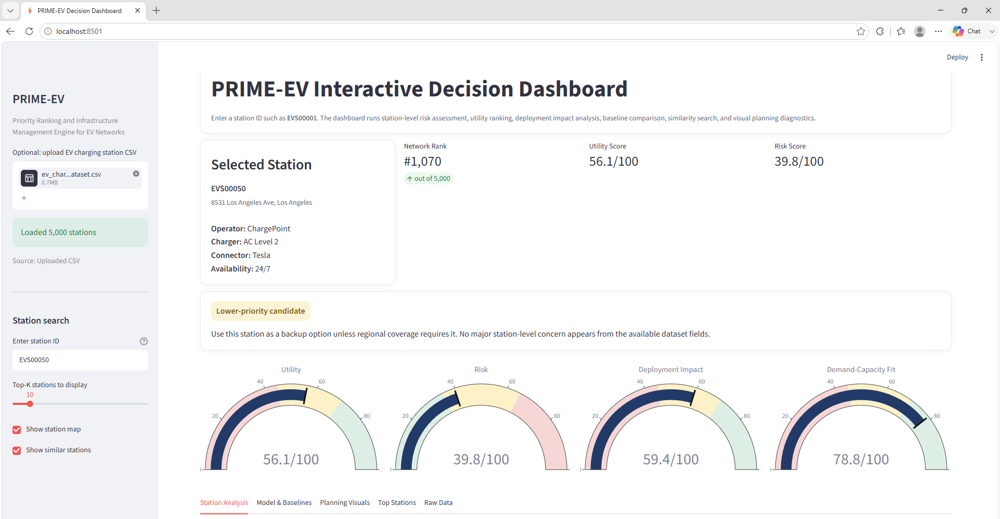
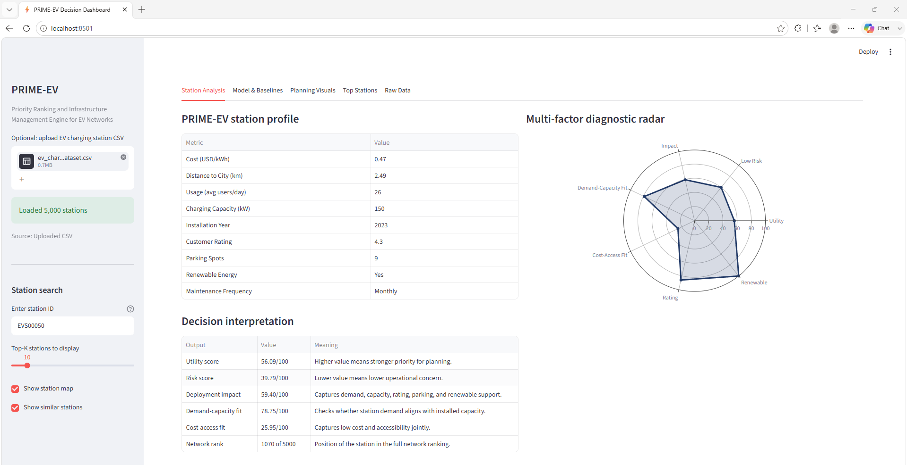
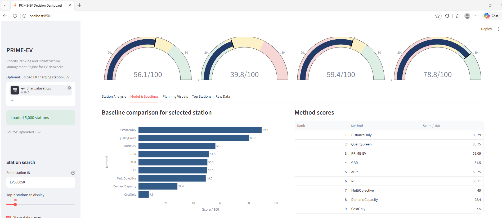
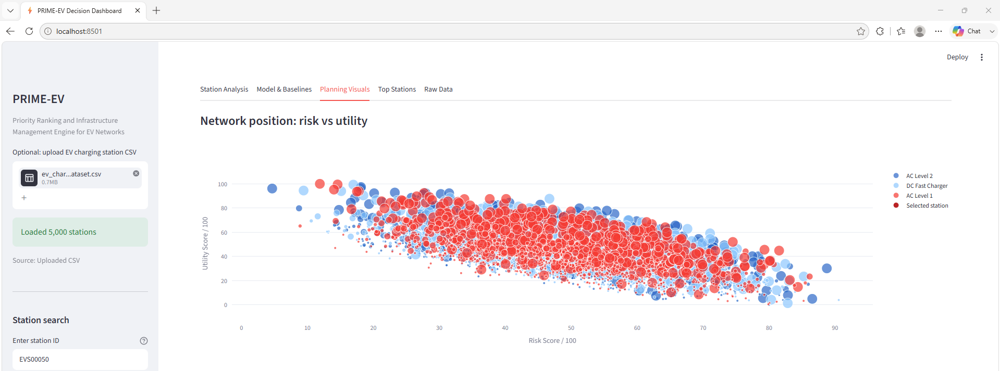
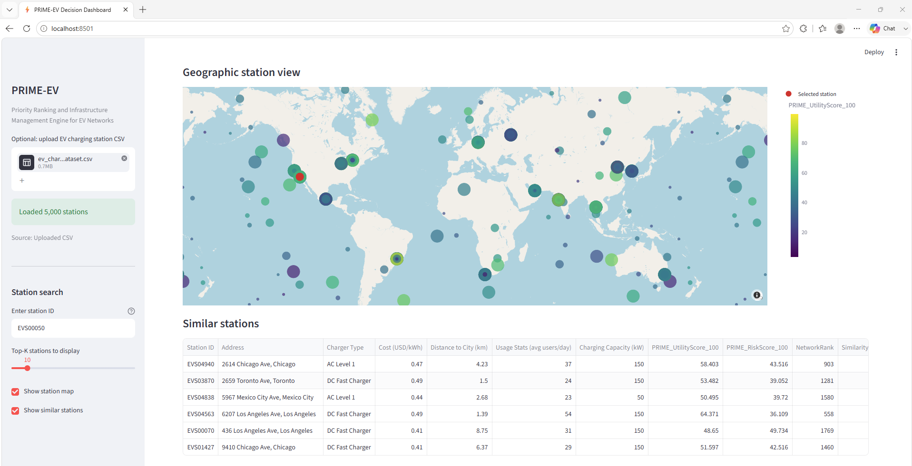
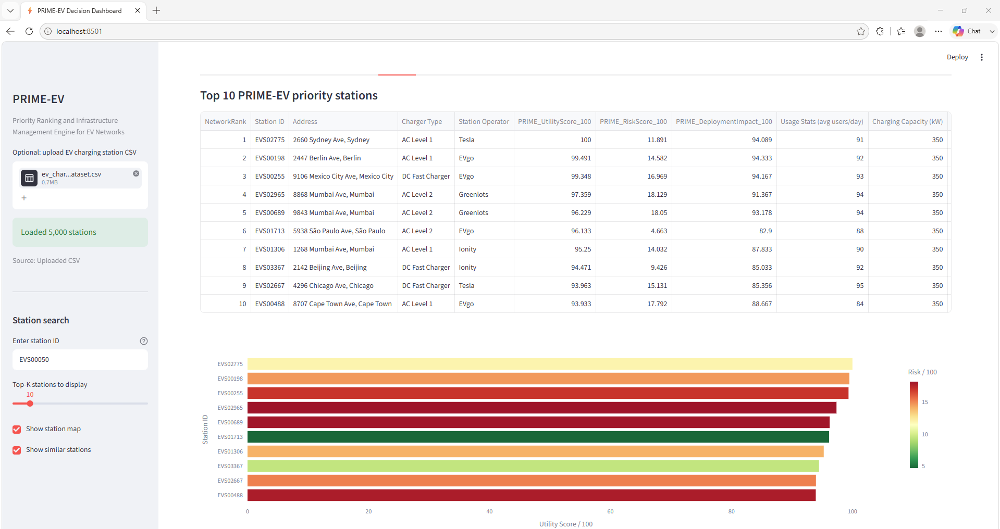
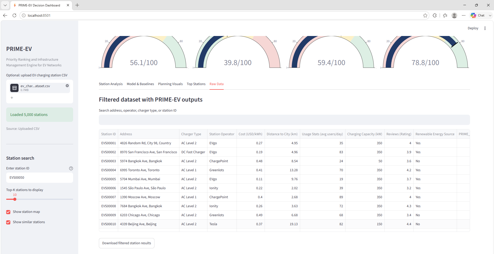

# PRIME-EV

<p align="center">
  
  
  
  
</p>

## RIME-EV: A Learning-to-Rank Framework for EV Charging-Station Screening under Indirect Supervision

Official research repository for **PRIME-EV**, a decision-support framework for EV charging infrastructure prioritization and planning.

Repository: `https://github.com/mishaurooj/PRIME-EV`

# PRIME-EV Interactive Decision Dashboard

PRIME-EV is an interactive Streamlit dashboard for EV charging station prioritization. It lets you enter a station ID such as `EVS00001` or `EVS00050`, then runs station-level risk assessment, utility ranking, deployment impact analysis, baseline comparison, similarity search, map visualization, and top-priority station screening.

## Dashboard Demonstration

A complete walkthrough of the PRIME-EV Interactive Decision Dashboard is available below.

https://github.com/mishaurooj/PRIME-EV/blob/main/prime-ev-app.mp4

## Dashboard Preview

### 1. Executive Overview



---

### 2. Station Profile and Multi-Factor Diagnostic Radar



---

### 3. Baseline Comparison and Method Scores



---

### 4. Network Position Analysis: Risk versus Utility



---

### 5. Geographic Station Visualization and Similar Stations



---

### 6. Top PRIME-EV Priority Stations



---

### 7. Raw Dataset Exploration and Downloadable Results



---

## Dataset

This repository uses the public **Global EV Charging Stations Dataset**.

| Attribute Group | Examples |
|---|---|
| Spatial | Location, region, distance indicators |
| Technical | Charger type, capacity, connector type |
| Operational | Usage, availability, installation year |
| Economic | Cost and pricing indicators |
| Sustainability | Renewable energy share |
| User feedback | Ratings and reviews |
| Maintenance | Maintenance frequency and parking capacity |

Dataset source: `https://www.kaggle.com/datasets/vivekattri/global-ev-charging-stations-dataset`

---

## Repository Structure

```text
PRIME-EV/
├── Code/
│   ├── PRIME_EV_FULL.ipynb
│   └── prime_ev_ieee_response_validation.py
├── Dataset/
│   └── ev_charging_stations-dataset.csv
├── Results/
│   ├── Figures/
│   └── Tables/
├── Trained-model-weights/
├── README.md
├── LICENSE
└── prime_ev_architecture_2.png
```

---

## How to Run with Anaconda

### 1. Clone the repository

```bash
git clone https://github.com/mishaurooj/PRIME-EV.git
cd PRIME-EV
```

### 2. Create the environment

```bash
conda create -n prime-ev python=3.10 -y
conda activate prime-ev
```

### 3. Install dependencies

```bash
pip install torch numpy pandas scipy scikit-learn matplotlib seaborn jupyter nbformat
```

### 4. Run the notebook

```bash
jupyter notebook Code/PRIME_EV_FULL.ipynb
```

### 5. Run the validation script

```bash
python Code/prime_ev_ieee_response_validation.py
```

---

## License

Apache 2.0 License.
